# US Media: Data Tracker 1Q26

16 April 2026

natural_image

Wall display of a collage of diverse digital content images, including images of people, sports, and food, with no visible text or symbols.

This is our regular quarterly US Media Data Tracker product, which examines trends in viewership on TV, the most popular series/movies by streaming platform, catalogues, value for money, cable audiences, box office and sports viewership.

# Netflix's Slate Still Looks Good But It Will Face Tough Comps in 2H26:

Netflix's share of the Top-20 shows dropped from 46% to 40% even as viewership continued to grow (+14% yoy).   
While Netflix’s share of releases is increasing in 2Q26 to 57%, it has only 40% of the Top-25 most-anticipated shows. Netflix is ramping production volumes to fill gaps. We reckon that its dominance in 4Q25 should not be extrapolated forward, even if Netflix held share over the past two years, as competition continues to rise with generally better-funded rivals.

# WBD Continues to Win in Content Terms:

WBD dominated MovieMeter rankings across all titles, and both TV shows and Movies in 1Q26, with The Pitt S2 emerging as a multi-season blockbuster. Its Top-20 viewership grew 84% this quarter. PSKY is buying a healthy studio.   
HBO Max launched in European markets driving it to #2 global streaming according to FlixPatrol.   
• Combining WBD and Paramount creates a market with 4 main players (Disney, PSKY, Netflix, Amazon): What does Comcast do?

# Content Production Is Ramping to Pre-Strike Levels; Competition Is Rising Once Again:

• Titles in production accelerated in 1Q26 with the sector approaching the '23, pre-strike, peak production.   
. Paramount and WBD are lowering production as they get ready to merge.   
• With increasing margins, continued revenue growth and improved balance sheets, the threat of heightened competitive intensity is a real risk, in our view.

# Nielsen's Measurement Changes Implies More Growth Ahead for Streaming:

Nielsen changed its panel sources and technology, delaying The Gauge data for March. According to the WSJ, the new measures put streaming share 6ppts lower (now 42%).   
This creates issues in the future for yoy comps and makes linear ratings hard to extrapolate from. Notably, Fox seems to have faced a tough comp and a sizeable ratings decline even with the boost to linear viewing from the methodology change.

# F1 Transition to Apple TV Had Higher Opener Viewing; Step Change in TKO's UFC Viewing With PSKY:

Australian GP US viewing above ESPN levels for the season opener. With Bahrain/Saudi cancelled, next test will be Miami GP, which is expected to be Apple's first FTA race, competing with ABC broadcast last year. Jury out on new F1 regs. viewing impact.   
• UFC's CBS/Paramount+ debut brought a step-change in US viewership – \~5m avg. for numbered events vs. 1.5-2m EPSN PPVs.

<table><tr><td>Alphabet - BUY</td><td>YouTube share gains continued to stall even if reaching ATHs in viewership.</td></tr><tr><td>Amazon - BUY</td><td>Prime Video continues to outspend the competition and make in-roads in terms of hits.</td></tr><tr><td>Apple - BUY</td><td>Apple TV continues to apply the HBO playbook.</td></tr><tr><td>Comcast - SELL</td><td>Peacock gained 218bps of streaming share in February (likely NFL/Olympics driven) but structurally will have to find a solution beyond sports rights. Super Mario Galaxy was the box office hit of the quarter (&gt;$600M on $100M budget).</td></tr><tr><td>Fox Corporation - BUY</td><td>Tubi&#x27;s growth appears to have stalled for now. Fox News had a tough comp in 1Q26.</td></tr><tr><td>Formula One Group - BUY</td><td>Apple seems to be driving engagement growth for F1. Ticket prices increased above inflation. Attendance up +9% in 1Q26.</td></tr><tr><td>Netflix - Buy</td><td>Stranger Things final season carried another quarter for Netflix, but the pipeline now looks thinner, with management compensating via catalogue expansion.</td></tr><tr><td>Paramount Skydance - NEUTRAL</td><td>Sequentially worse quarter for Paramount+. Also a weak Box Office.</td></tr><tr><td>Roku - BUY</td><td>Roku channel continues to grow.</td></tr><tr><td>Sony Group - BUY</td><td>Looking like &#x27;26 on track to be a great year for the Pictures division with a strong slate.</td></tr><tr><td>The Walt Disney Company - SELL</td><td>Disney+ was down 7% and Hulu down 60% in Top-20 viewership yoy. Disney+ and Hulu are starting to ramp their catalogues once again.</td></tr><tr><td>TKO Group Holdings - NEUTRAL</td><td>UFC&#x27;s CBS/Paramount+ debut brought a step-change in domestic viewership — ~5m average for numbered events vs. estimated 1.5-2m PPVs during the ESPN era.</td></tr><tr><td>Versant Media - SELL</td><td>Versant hard to extrapolate from Nielsen data given viewership metric changes. Rating benefited from Winter Olympics although limited economic effect (space rented by Comcast).</td></tr><tr><td>Warner Bros. Discovery - Neutral</td><td>The content winner in 1Q26, topping MovieMeter rankings in all categories. HBO Max grew 84% yoy in Top-20 viewership and now offers the best cost-per-hit at its price point. Launch in the UK, Germany, Italy resulted in #2 global streaming service per FlixPatrol data.</td></tr></table>

# Streaming Analysis

Insights From The Gauge: Million Viewer Minutes per Medium (Left), Change YoY (Right)   
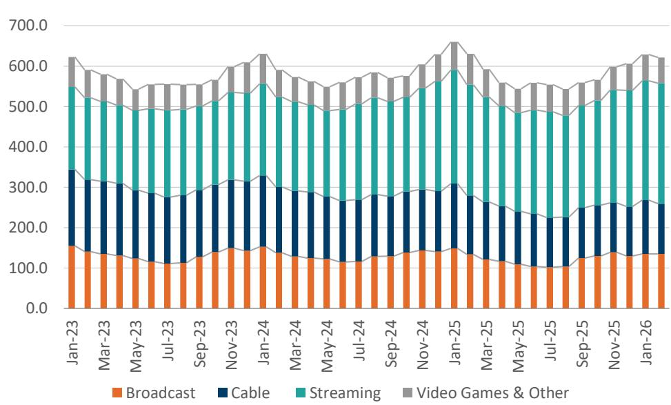

bar_stacked

| Month | Broadcast | Cable | Streaming | Video Games & Other |
| :--- | :--- | :--- | :--- | :--- |
| Jan-23 | 160.0 | 180.0 | 160.0 | 140.0 |
| Mar-23 | 130.0 | 190.0 | 170.0 | 130.0 |
| May-23 | 120.0 | 180.0 | 180.0 | 130.0 |
| Jul-23 | 110.0 | 170.0 | 180.0 | 130.0 |
| Sep-23 | 120.0 | 180.0 | 180.0 | 130.0 |
| Nov-23 | 140.0 | 190.0 | 180.0 | 140.0 |
| Jan-24 | 150.0 | 190.0 | 180.0 | 140.0 |
| Mar-24 | 120.0 | 180.0 | 180.0 | 130.0 |
| May-24 | 110.0 | 170.0 | 180.0 | 130.0 |
| Jul-24 | 110.0 | 170.0 | 180.0 | 130.0 |
| Sep-24 | 120.0 | 180.0 | 180.0 | 130.0 |
| Nov-24 | 140.0 | 190.0 | 180.0 | 140.0 |
| Jan-25 | 150.0 | 190.0 | 180.0 | 140.0 |
| Mar-25 | 120.0 | 180.0 | 180.0 | 130.0 |
| May-25 | 110.0 | 170.0 | 180.0 | 130.0 |
| Jul-25 | 100.0 | 160.0 | 180.0 | 130.0 |
| Sep-25 | 120.0 | 170.0 | 180.0 | 130.0 |
| Nov-25 | 130.0 | 180.0 | 180.0 | 140.0 |
| Jan-26 | 130.0 | 180.0 | 180.0 | 140.0 |

Source: Nielsen, Arete Research.

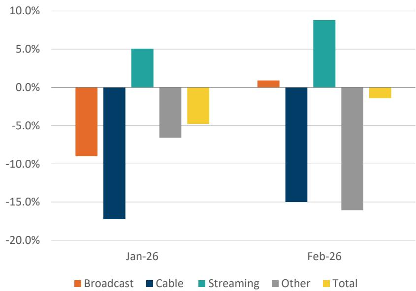

bar

| Category | Jan-26 (%) | Feb-26 (%) |
| :--- | :--- | :--- |
| Broadcast | -9.0 | 0.8 |
| Cable | -17.5 | -15.0 |
| Streaming | 5.0 | 8.8 |
| Other | -6.5 | -16.5 |
| Total | -4.5 | -1.0 |

Source: Nielsen, Arete Research.

Neilsen's methodology is changing with adjustment to panel demographics and technology, expected to increase the recordedTh linear audience by 6ppts rel. to streaming (WSJ, Mar. ‘26). Data for Mar. '26 has been delayed and is not included in our report.   
▪ The available data up until Feb. '26 is still based on Nielsen’s old methodology, hence lfl comparisons are still valid.   
▪ Cable declines accelerated on a yoy basis in both Jan. and Feb. '26.   
▪ Broadcast grew 1% yoy in Feb. after declining 9% in Jan., averaging LSD declines despite the Winter Olympics, pointing to a probable worsening of decline vs. -3% in the prior year.   
▪ Streaming grew 5% in Jan. and 9% in Feb. These are much lower growth rates than seen in the corresponding month in '24 and '25.   
▪ Overall TV viewership was down 5% in Jan. and 1% in Feb.

Million Viewer Minutes per Platform per Week, Top-20 Nielsen Shows (US)   
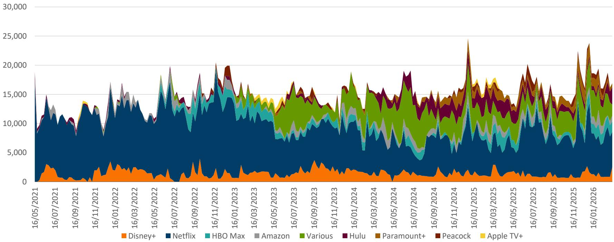

bar_stacked

| Date       | Disney+ | Netflix | HBO Max | Amazon | Various | Hulu | Paramount+ | Peacock | Apple TV+ |
|------------|---------|---------|---------|--------|---------|------|------------|---------|-----------|
| 16/05/2021 | 1000    | 8000    | 1000    | 1000   | 500     | 500  | 500        | 500     | 500       |
| 16/07/2021 | 1000    | 8000    | 1000    | 1000   | 500     | 500  | 500        | 500     | 500       |
| 16/09/2021 | 1000    | 8000    | 1000    | 1000   | 500     | 500  | 500        | 500     | 500       |
| 16/11/2021 | 1000    | 8000    | 1000    | 1000   | 500     | 500  | 500        | 500     | 500       |
| 16/01/2022 | 1000    | 8000    | 1000    | 1000   | 500     | 500  | 500        | 500     | 500       |
| 16/03/2022 | 1000    | 8000    | 1000    | 1000   | 500     | 500  | 500        | 500     | 500       |
| 16/05/2022 | 1000    | 8000    | 1000    | 1000   | 500     | 500  | 500        | 500     | 500       |
| 16/07/2022 | 1000    | 8000    | 1000    | 1000   | 500     | 500  | 500        | 500     | 500       |
| 16/09/2022 | 1000    | 8000    | 1000    | 1000   | 500     | 500  | 500        | 500     | 500       |
| 16/11/2022 | 1000    | 8000    | 1000    | 1000   | 500     | 500  | 500        | 500     | 500       |
| 16/01/2023 | 1000    | 8000    | 1000    | 1000   | 500     | 500  | 500        | 500     | 500       |
| 16/03/2023 | 1000    | 8000    | 1000    | 1000   | 500     | 500  | 500        | 500     | 500       |
| 16/05/2023 | 1000    | 8000    | 1000    | 1000   | 500     | 500  | 500        | 500     | 500       |
| 16/07/2023 | 1000    | 8000    | 1000    | 1000   | 500     | 500  | 500        | 500     | 500       |
| 16/09/2023 | 1000    | 8000    | 1000    | 1000   | 500     | 500  | 500        | 500     | 500       |
| 16/11/2023 | 1000    | 8000    | 1000    | 1000   | 500     | 500  | 500        | 500     | 500       |
| 16/01/2024 | 1000    | 8000    | 1000    | 1000   | 500     | 500  | 500        | 500     | 500       |
| 16/03/2024 | 1000    | 8000    | 1000    | 1000   | 500     | 500  | 500        | 500     | 500       |
| 16/05/2024 | 1000    | 8000    | 1000    | 1000   | 500     | 500  | 500        | 500     | 500       |
| 16/07/2024 | 1000    | 8000    | 1000    | 1000   | 500     | 500  | 500        | 500     | 500       |
| 16/09/2024 | 1000    | 8000    | 1000    | 1000   | 500     | 500  | 500        | 500     | 500       |
| 16/11/2024 | 1000    | 8000    | 1000    | 1000   | 500     | 500  | 500        | 500     | 500       |
| 16/01/2025 | 1000    | 8000    | 1000    | 1000   | 500     | 500  | 500        | 500     | 500       |
| 16/03/2025 | 1000    | 8000    | 1000    | 1000   | 500     | 500  | 500        | 500     | 500       |
| 16/05/2025 | 1000    | 8000    | 1000    | 1000   | 500     | 500  | 500        | 500     | 500       |
| 16/07/2025 | 1000    | 8000    | 1000    | 1000   | 500     | 500  | 500        | 500     | 500       |
| 16/09/2025 | 1000    | 8000    | 1000    | 1000   | 500     | 500  | 500        | 500     | 500       |
| 16/11/2025 | 1000    | 8000    | 1000    | 1000   | 500     | 500  | 500        | 500     | 500       |
| 16/01/2026 | 1000    | 8000    | 1000    | 1000   | 500     | 500  | 500        | 500     | 500       |

Source: Nielsen, Arete Research.

▪ Aggregate Top-20 viewership was +6% yoy in 1Q26, continuing to grow at a similar pace to recent quarters.   
▪ Netflix's share dropped from 46% in 4Q to 40% in the first 11 weeks of 1Q26 after an exceptional year-end slate, with Top-20 viewership +14% yoy in absolute terms.   
▪ HBO Max, Paramount+ and Peacock continued to grow rapidly (+84%, +53%, +73%, respectively, yoy).   
▪ Hulu and Disney+ were down 50% and 7%, respectively, continuing to underperform.

Top-20 Shows Organised by Platform: Spotlight 1Q26 (Million Minutes P2+) 

<table><tr><td>Title (Platform)</td><td>Rank</td><td>Minutes (m)</td></tr><tr><td>Stranger Things (Netflix)</td><td>1</td><td>20740</td></tr><tr><td>Bridgerton (Netflix)</td><td>2</td><td>12763</td></tr><tr><td>The Pitt (Max)</td><td>3</td><td>11100</td></tr><tr><td>Bluey (Disney+)</td><td>4</td><td>9811</td></tr><tr><td>The Big Bang Theory (Max)</td><td>5</td><td>8493</td></tr><tr><td>The Lincoln Lawyer (Netflix)</td><td>6</td><td>7479</td></tr><tr><td>Landman (Paramount+)</td><td>7</td><td>7441</td></tr><tr><td>Law &amp; Order (Hulu/Peacock)</td><td>8</td><td>6614</td></tr><tr><td>Grey&#x27;s Anatomy (Hulu/Netflix)</td><td>9</td><td>6609</td></tr><tr><td>SpongeBob SquarePants (Paramount+)</td><td>10</td><td>6218</td></tr><tr><td>Fallout (Amazon)</td><td>11</td><td>6171</td></tr><tr><td>The Traitors (Peacock)</td><td>12</td><td>5974</td></tr><tr><td>The Night Agent (Netflix)</td><td>13</td><td>5738</td></tr><tr><td>The Closer (Netflix/Peacock/Pluto TV)</td><td>14</td><td>5542</td></tr><tr><td>His &amp; Hers (Netflix)</td><td>15</td><td>5468</td></tr><tr><td>Family Guy (Hulu)</td><td>16</td><td>4919</td></tr><tr><td>Rizzoli &amp; Isles (Netflix/Peacock/Pluto TV)</td><td>17</td><td>4342</td></tr><tr><td>Love Is Blind (Netflix)</td><td>18</td><td>3865</td></tr><tr><td>Paw Patrol (Netflix/Paramount+)</td><td>19</td><td>3507</td></tr><tr><td>Bob&#x27;s Burgers (Hulu)</td><td>20</td><td>3173</td></tr></table>

Source: Nielsen, Arete Research.

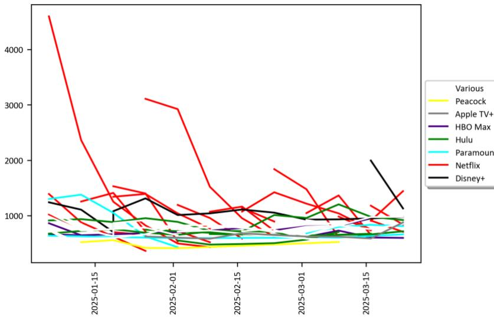

line

| Date       | Peacock | Apple TV+ | HBO Max | Hulu  | Paramount | Netflix | Disney+ |
| ---------- | ------- | --------- | ------- | ----- | --------- | ------- | ------- |
| 2025-01-15 | 500     | 800       | 600     | 700   | 1300      | 4500    | 1200    |
| 2025-02-01 | 400     | 700       | 500     | 600   | 1000      | 3000    | 1000    |
| 2025-02-15 | 300     | 600       | 400     | 500   | 800       | 1500    | 900     |
| 2025-03-01 | 200     | 500       | 300     | 400   | 600       | 1800    | 800     |
| 2025-03-15 | 100     | 400       | 200     | 300   | 400       | 1400    | 1000    |

Source: Nielsen, Arete Research.

Netflix had a mega-hit with the last season of Stranger Things, topping the charts for two quarters in a row. However, Netflix only had 6 exclusives in the Top-20 vs. 9 in the prior quarter.   
▪ The remainder of viewing was fragmented, although notably early data for 15 episode The Pitt S2 is suggesting that it may turn into a valuable broadcast-like show for Warner Bros Television, given that the premiere was up >200% vs. last season.

Services, Catalogues and Consumer Price Per "Hit" 

<table><tr><td>Platform</td><td>Catalogue</td><td>Hits</td><td>TV Shows</td><td>Movies</td><td>Streams</td><td>Quality</td><td>Download</td><td>Other Perks</td><td>Price</td><td>Platform</td><td>Cost per Hit</td><td>LTM Hitrate</td><td>Arete Score</td></tr><tr><td>Ad-tier</td><td></td><td></td><td></td><td></td><td></td><td></td><td></td><td></td><td></td><td>Ad-tier</td><td></td><td></td><td></td></tr><tr><td>Netflix Standard With Ads</td><td>7,409</td><td>1,337</td><td>3,174</td><td>4,235</td><td>2720p</td><td>no</td><td colspan="2">Mobile Games</td><td>$8.99</td><td>Netflix Standard With Ads</td><td>0.67c</td><td>18%</td><td>3.7</td></tr><tr><td>HBO Max Ad-Supported</td><td>3,605</td><td>1,050</td><td>1,692</td><td>1,913</td><td>21080p</td><td>no</td><td colspan="2">Sports</td><td>$10.99</td><td>HBO Max Ad-Supported</td><td>1.05c</td><td>29%</td><td>3.6</td></tr><tr><td>Disney+</td><td>2,292</td><td>439</td><td>821</td><td>1,471</td><td>44K</td><td>no</td><td colspan="2"></td><td>$11.99</td><td>Disney+</td><td>2.73c</td><td>19%</td><td>14.3</td></tr><tr><td>Hulu</td><td>2,950</td><td>738</td><td>1,759</td><td>1,191</td><td>24K</td><td>no</td><td colspan="2"></td><td>$11.99</td><td>Hulu</td><td>1.62c</td><td>25%</td><td>6.5</td></tr><tr><td>Disney Bundle</td><td>5,242</td><td>1,177</td><td>2,580</td><td>2,662</td><td></td><td></td><td colspan="2"></td><td>$12.99</td><td>Disney Bundle</td><td>1.10c</td><td>22%</td><td>4.9</td></tr><tr><td>Paramount+</td><td>1,583</td><td>385</td><td>635</td><td>948</td><td>34K</td><td>no</td><td colspan="2">Sports</td><td>$8.99</td><td>Paramount+</td><td>2.34c</td><td>24%</td><td>9.6</td></tr><tr><td>Peacock</td><td>1,986</td><td>441</td><td>1,085</td><td>901</td><td>34K</td><td>no</td><td colspan="2">Sports</td><td>$10.99</td><td>Peacock</td><td>2.49c</td><td>22%</td><td>11.2</td></tr><tr><td>Standard</td><td></td><td></td><td></td><td></td><td></td><td></td><td></td><td></td><td></td><td>Standard</td><td></td><td></td><td></td></tr><tr><td>Netflix Standard</td><td>7,645</td><td>1,372</td><td>3,228</td><td>4,417</td><td>21080p</td><td></td><td colspan="2">100Mobile Games</td><td>$19.99</td><td>Netflix Standard</td><td>1.46c</td><td>18%</td><td>8.1</td></tr><tr><td>HBO Max Ad-Free</td><td>3,605</td><td>1,050</td><td>1,692</td><td>1,913</td><td>21080p</td><td></td><td colspan="2">30Sports</td><td>$18.49</td><td>HBO Max Ad-Free</td><td>1.76c</td><td>29%</td><td>6.0</td></tr><tr><td>Disney+</td><td>2,292</td><td>439</td><td>821</td><td>1,471</td><td>44K</td><td>unlimited</td><td colspan="2"></td><td>$18.99</td><td>Disney+</td><td>4.33c</td><td>19%</td><td>22.6</td></tr><tr><td>Hulu</td><td>2,950</td><td>738</td><td>1,759</td><td>1,191</td><td>24K</td><td></td><td colspan="2">25</td><td>$18.99</td><td>Hulu</td><td>2.57c</td><td>25%</td><td>10.3</td></tr><tr><td>Disney Bundle</td><td>5,242</td><td>1,177</td><td>2,580</td><td>2,662</td><td></td><td></td><td colspan="2"></td><td>$19.99</td><td>Disney Bundle</td><td>1.70c</td><td>22%</td><td>7.6</td></tr><tr><td>Paramount+</td><td>1,595</td><td>388</td><td>643</td><td>952</td><td>34K</td><td></td><td colspan="2">25CBS &amp; Sports</td><td>$13.99</td><td>Paramount+</td><td>3.61c</td><td>24%</td><td>14.8</td></tr><tr><td>Peacock</td><td>1,986</td><td>441</td><td>1,085</td><td>901</td><td>34K</td><td></td><td colspan="2">25NBC &amp; Sports</td><td>$16.99</td><td>Peacock</td><td>3.85c</td><td>22%</td><td>17.3</td></tr><tr><td>Premium</td><td></td><td></td><td></td><td></td><td></td><td></td><td></td><td></td><td></td><td>Premium</td><td></td><td></td><td></td></tr><tr><td>Netflix Ultimate</td><td>7,645</td><td>1,372</td><td>3,228</td><td>4,417</td><td>44K</td><td></td><td colspan="2">100Mobile Games</td><td>$26.99</td><td>Netflix Ultimate</td><td>1.97c</td><td>18%</td><td>11.0</td></tr><tr><td>Max Ultimate</td><td>3,605</td><td>1,050</td><td>1,692</td><td>1,913</td><td>44K</td><td></td><td colspan="2">30</td><td>$22.99</td><td>Max Ultimate</td><td>2.19c</td><td>29%</td><td>7.5</td></tr></table>

Source: JustWatch, Various Press Sources, Arete Research. Arete Score: Lower = Better.

HBO Max now looks like the most competitive streamer when factoring cost per hit and hit rate (Arete Score, lower = better).   
▪ Netflix continues to retain an absolute advantage measured in consumer cost per hit, even taking into account the Mar. '26 US price rises.   
Combining WBD and Paramount+ with the proposed merger of PSKY and WBD matches the Disney Bundle in scale terms, and creates a more consolidated market dominated by three large streamers + Prime Video.   
Peacock looks like the laggard and seems like it still needs to work on long-term streaming viability beyond bunding sports rights, which we do not see as a sustainable source of competitive advantage.

Nielsen Incr. Av. Weekly Viewership (bn Minutes) Per Platform (Left), Shares of Streaming Viewership (Right)   
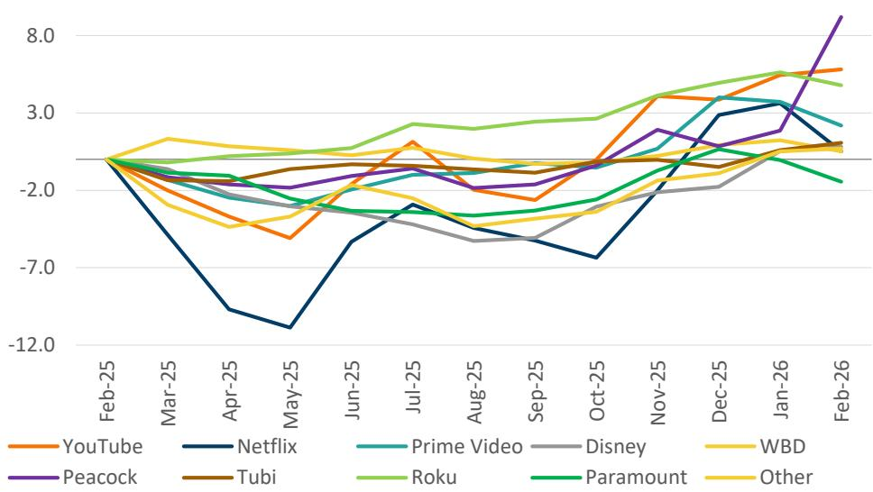

line

| Month   | YouTube | Netflix | Prime Video | Disney | WBD  | Peacock | Tubi | Roku | Paramount | Other |
|---------|---------|---------|-------------|--------|------|---------|------|------|-----------|-------|
| Feb-25  | -1.5    | -1.5    | -1.5        | -1.5   | -1.5 | -1.5    | -1.5 | -1.5 | -1.5      | -1.5  |
| Mar-25  | -1.8    | -1.8    | -1.8        | -1.8   | -1.8 | -1.8    | -1.8 | -1.8 | -1.8      | -1.8  |
| Apr-25  | -2.2    | -1.2    | -2.0        | -2.0   | -2.0 | -2.0    | -2.0 | -2.0 | -2.0      | -2.0  |
| May-25  | -2.5    | -1.5    | -2.2        | -2.2   | -2.2 | -2.2    | -2.2 | -2.2 | -2.2      | -2.2  |
| Jun-25  | -2.0    | -0.8    | -2.0        | -2.5   | -2.5 | -2.5    | -2.5 | -2.5 | -2.5      | -2.5  |
| Jul-25  | -1.5    | -0.5    | -1.8        | -2.8   | -2.8 | -2.8    | -2.8 | -2.8 | -2.8      | -2.8  |
| Aug-25  | -1.8    | -0.3    | -1.5        | -3.0   | -3.0 | -3.0    | -3.0 | -3.0 | -3.0      | -3.0  |
| Sep-25  | -2.0    | -0.5    | -1.8        | -3.2   | -3.2 | -3.2    | -3.2 | -3.2 | -3.2      | -3.2  |
| Oct-25  | -1.5    | -0.8    | -1.5        | -3.5   | -3.5 | -3.5    | -3.5 | -3.5 | -3.5      | -3.5  |
| Nov-25  | -1.0    | -0.5    | -1.0        | -3.0   | -3.0 | -3.0    | -3.0 | -3.0 | -3.0      | -3.0  |
| Dec-25  | -0.5    | -0.2    | -0.5        | -2.5   | -2.5 | -2.5    | -2.5 | -2.5 | -2.5      | -2.5  |
| Jan-26  | 0.0     | 0.0     | 0.0         | -2.0   | -2.0 | -2.0    | -2.0 | -2.0 | -2.0      | -2.0  |
| Feb-26  | 0.5     | 0.5     | 0.5         | -1.5   | -1.5 | 0.5     | -1.5 | -1.5 | -1.5      | -1.5  |

Source: Nielsen, Arete Research.

<table><tr><td>Date</td><td>Nov-25</td><td>Dec-25</td><td>Jan-26</td><td>Feb-26</td><td></td></tr><tr><td>YouTube (ex-TV)</td><td>27.74%</td><td>26.68%</td><td>26.48%</td><td>26.51%</td><td>-123bps</td></tr><tr><td>Netflix</td><td>17.85%</td><td>18.91%</td><td>18.64%</td><td>17.54%</td><td>-31bps</td></tr><tr><td>Prime Video</td><td>8.17%</td><td>9.03%</td><td>8.69%</td><td>8.14%</td><td>-3bps</td></tr><tr><td>Disney</td><td>10.11%</td><td>9.87%</td><td>10.38%</td><td>10.44%</td><td>33bps</td></tr><tr><td>WBD</td><td>2.80%</td><td>2.94%</td><td>2.97%</td><td>2.71%</td><td>-8bps</td></tr><tr><td>Peacock</td><td>4.09%</td><td>3.57%</td><td>3.81%</td><td>6.26%</td><td>218bps</td></tr><tr><td>Tubi</td><td>4.52%</td><td>4.20%</td><td>4.45%</td><td>4.59%</td><td>8bps</td></tr><tr><td>Roku</td><td>6.24%</td><td>6.30%</td><td>6.36%</td><td>6.05%</td><td>-18bps</td></tr><tr><td>Paramount</td><td>4.95%</td><td>5.25%</td><td>4.87%</td><td>4.38%</td><td>-56bps</td></tr><tr><td>Other</td><td>13.76%</td><td>13.94%</td><td>13.76%</td><td>13.55%</td><td>-19bps*</td></tr></table>

Source: Nielsen, Arete Research.

▪ Netflix and YouTube lost share to Peacock, likely due to Peacock showing both the NFL Super Bowl and Winter Olympics this quarter.   
▪ Other player shares were relatively stable in the quarter.   
▪ In absolute terms, all platforms reached new highs, aside from Paramount, which had a very difficult 1Q25 comp.   
▪ Roku and YouTube continue to grow viewership the fastest yoy.

Catalogue Growth by Streamer   
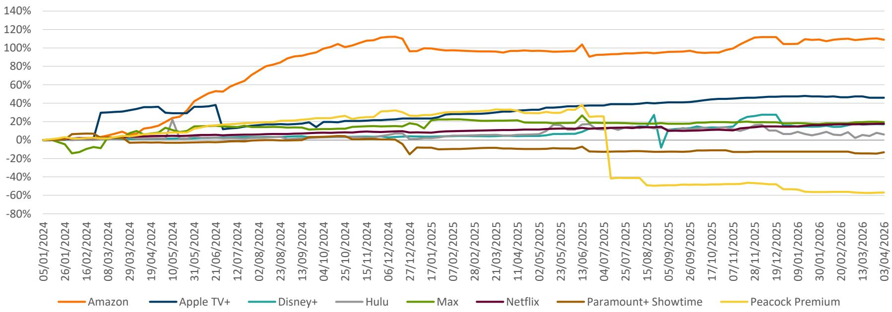

line

| Date       | Amazon | Apple TV+ | Disney+ | Hulu | Max  | Netflix | Paramount+ Showtime | Peacock Premium |
|------------|--------|-----------|---------|------|------|---------|---------------------|-----------------|
| 05/01/2024 | 0%     | 0%        | 0%      | 0%   | 0%   | 0%      | 0%                  | 0%              |
| 26/01/2024 | 0%     | 0%        | 0%      | 0%   | 0%   | 0%      | 0%                  | 0%              |
| 16/02/2024 | 0%     | 0%        | 0%      | 0%   | 0%   | 0%      | 0%                  | 0%              |
| 08/03/2024 | 0%     | 0%        | 0%      | 0%   | 0%   | 0%      | 0%                  | 0%              |
| 29/03/2024 | 0%     | 0%        | 0%      | 0%   | 0%   | 0%      | 0%                  | 0%              |
| 19/04/2024 | 0%     | 0%        | 0%      | 0%   | 0%   | 0%      | 0%                  | 0%              |
| 10/05/2024 | 0%     | 0%        | 0%      | 0%   | 0%   | 0%      | 0%                  | 0%              |
| 31/05/2024 | 0%     | 0%        | 0%      | 0%   | 0%   | 0%      | 0%                  | 0%              |
| 21/06/2024 | 0%     | 0%        | 0%      | 0%   | 0%   | 0%      | 0%                  | 0%              |
| 12/07/2024 | 0%     | 0%        | 0%      | 0%   | 0%   | 0%      | 0%                  | 0%              |
| 02/08/2024 | 0%     | 0%        | 0%      | 0%   | 0%   | 0%      | 0%                  | 0%              |
| 23/08/2024 | 0%     | 0%        | 0%      | 0%   | 0%   | 0%      | 0%                  | 0%              |
| 13/09/2024 | 0%     | 0%        | 0%      | 0%   | 0%   | 0%      | 0%                  | 0%              |
| 04/10/2024 | 0%     | 0%        | 0%      | 0%   | 0%   | 0%      | 0%                  | 0%              |
| 25/10/2024 | 0%     | 0%        | 0%      | 0%   | 0%   | 0%      | 0%                  | 0%              |
| 15/11/2024 | 0%     | 0%        | 0%      | 0%   | 0%   | 0%      | 0%                  | 0%              |
| 06/12/2024 | 0%     | 0%        | 0%      | 0%   | 0%   | 0%      | 0%                  | 0%              |
| 27/12/2024 | 0%     | 0%        | 0%      | 0%   | 0%   | 0%      | 0%                  | 0%              |
| 17/01/2025 | 0%     | 0%        | 0%      | 0%   | 0%   | 0%      | 0%                  | 0%              |
| 07/02/2025 | 0%     | 0%        | 0%      | 0%   | 0%   | 0%      | 0%                  | 0%              |
| 28/02/2025 | 0%     | 0%        | 0%      | 0%   | 0%   | 0%      | 0%                  | 0%              |
| 21/03/2025 | 0%     | 0%        | 0%      | 0%   | 0%   | 0%      | 0%                  | 0%              |
| 11/04/2025 | 0%     | 0%        | 0%      | 0%   | 0%   | 0%      | 0%                  | 0%              |
| 02/05/2025 | 0%     | 0%        | 0%      | 0%   | 0%   | 0%      | 0%                  | 0%              |
| 23/05/2025 | 0%     | 0%        | 0%      | 0%   | 0%   | 0%      | 0%                  | 0%              |
| 13/06/2025 | 0%     | 0%        | 0%      | 0%   | 0%   | 0%      | 0%                  | 0%              |
| 04/07/2025 | 0%     | 0%        | 0%      | 0%   | 0%   | 0%      | 0%                  | -40%            |
| 25/07/2025 | 0%     | 0%        | 0%      | 0%   | 0%   | 0%      | 0%                  | -40%            |
| 15/08/2025 | 0%     | 0%        | 0%      | 0%   | 0%   | 0%      | 0%                  | -50%            |
| 05/09/2025 | 0%     | 0%        | 0%      | 0%   | 0%   | 0%      | 0%                  | -50%            |
| 26/09/2025 | 0%     | 0%        | 0%      | 0%   | 0%   | 0%      | 0%                  | -50%            |
| 17/10/2025 | 0%     | 0%        | 0%      | 0%   | 0%   | 0%      | 0%                  | -50%            |
| 07/11/2025 | 0%     | 0%        | 0%      | 0%   | 0%   | 0%      | 0%                  | -50%            |
| 28/11/2025 | 0%     | 0%        | 0%      | 0%   | 0%   | 0%      | 0%                  | -50%            |
| 19/12/2025 | 0%     | 0%        | 0%      | 0%   | 0%   | 0%      | 0%                  | -50%            |
| 09/01/2026 | 0%     | 0%        | 0%      | 0%   | 0%   | 0%      | 0%                  | -50%            |
| 30/01/2026 | 0%     | 0%        | 0%      | 0%   | 0%   | 0%      | 0%                  | -50%            |
| 20/02/2026 | 0%     | 0%        | 0%      | 0%   | 0%   | 0%      | 0%                  | -50%            |
| 13/03/2026 | 0%     | 0%        | 0%      | 0%   | 0%   | 0%      | 0%                  | -50%            |
| 03/04/2026 | 0%     | 0%        | 0%      | 0%   | 0%   | 0%      | 0%                  | -50%            |

Source: JustWatch, Arete Research.

▪ Peacock/Paramount continued to reduce their catalogues, presumably making way for sports.   
▪ Disney+ had a slight catalogue increase, while Hulu declined.   
▪ Amazon and Apple TV both grew their catalogues at an above market rate.   
▪ Netflix accelerated catalogue growth during the quarter, presumably to try to offset very difficult yoy slate comps in 2H26 (Stranger Things final series, Squid Game S3, Knives Out 3, etc., in '25).   
Other platforms' catalogues tended to be relatively stable.

# Streaming Projects in Development

Projects in Development and in Production   
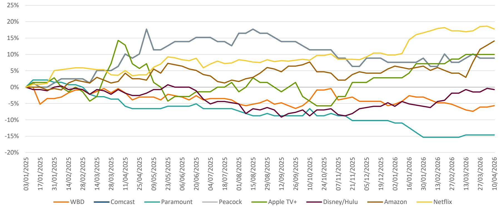

line

| Date       | WBD   | Comcast | Paramount | Peacock | Apple TV+ | Disney/Hulu | Amazon | Netflix |
|------------|-------|---------|-----------|---------|-----------|-------------|--------|---------|
| 03/01/2025 | 0.0%  | 0.0%    | 0.0%      | 0.0%    | 0.0%      | 0.0%        | 0.0%   | 0.0%    |
| 17/01/2025 | -5.0% | 0.0%    | 2.0%      | 0.0%    | 0.0%      | 0.0%        | 0.0%   | 0.0%    |
| 31/01/2025 | -3.0% | 0.0%    | 1.0%      | 0.0%    | 3.0%      | 0.0%        | 0.0%   | 5.0%    |
| 14/02/2025 | -2.0% | 0.0%    | 0.0%      | 0.0%    | 0.0%      | 0.0%        | 0.0%   | 5.0%    |
| 28/02/2025 | -1.0% | 0.0%    | -1.0%     | 0.0%    | -5.0%     | 0.0%        | 0.0%   | 5.0%    |
| 14/03/2025 | 0.0%  | 0.0%    | -3.0%     | 5.0%    | 0.0%      | 0.0%        | 0.0%   | 5.0%    |
| 28/03/2025 | 0.0%  | 0.0%    | -4.0%     | 5.0%    | 14.0%     | 0.0%        | 0.0%   | 4.0%    |
| 11/04/2025 | 0.0%  | 0.0%    | -6.0%     | 10.0%   | 12.0%     | 0.0%        | 0.0%   | 4.0%    |
| 25/04/2025 | 0.0%  | 0.0%    | -6.0%     | 18.0%   | 6.0%      | 0.0%        | 0.0%   | 4.0%    |
| 09/05/2025 | 0.0%  | 0.0%    | -6.0%     | 11.0%   | 0.0%      | 0.0%        | 0.0%   | 5.0%    |
| 23/05/2025 | 0.0%  | 0.0%    | -6.0%     | 14.0%   | -4.0%     | 0.0%        | 7.0%   | 9.0%    |
| 06/06/2025 | 0.0%  | 0.0%    | -6.0%     | 14.0%   | -3.0%     | 0.0%        | 7.0%   | 8.0%    |
| 20/06/2025 | 0.0%  | 0.0%    | -6.0%     | 15.0%   | -2.0%     | 0.0%        | 6.0%   | 8.0%    |
| 04/07/2025 | 0.0%  | 0.0%    | -6.0%     | 14.0%   | -1.0%     | 0.0%        | 4.0%   | 7.0%    |
| 18/07/2025 | 0.0%  | 0.0%    | -6.0%     | 13.0%   | 0.0%      | 0.0%        | 2.0%   | 7.0%    |
| 01/08/2025 | 0.0%  | 0.0%    | -6.0%     | 16.0%   | 2.0%      | 0.0%        | 2.0%   | 8.0%    |
| 15/08/2025 | 0.0%  | 0.0%    | -6.0%     | 18.0%   | 3.0%      | 0.0%        | 3.0%   | 8.0%    |
| 29/08/2025 | 0.0%  | 0.0%    | -6.0%     | 16.0%   | 1.0%      | 0.0%        | 6.0%   | 8.0%    |
| 12/09/2025 | 0.0%  | 0.0%    | -6.0%     | 14.0%   | -1.0%     | 0.0%        | 5.0%   | 8.0%    |
| 26/09/2025 | 0.0%  | 0.0%    | -6.0%     | 14.0%   | 1.0%      | 0.0%        | 6.0%   | 8.0%    |
| 10/10/2025 | 0.0%  | 0.0%    | -6.0%     | 11.0%   | -4.0%     | 0.0%        | 7.0%   | 9.0%    |
| 24/10/2025 | 0.0%  | 0.0%    | -6.0%     | 11.0%   | -5.0%     | 0.0%        | 5.0%   | 10.0%   |
| 07/11/2025 | 0.0%  | 0.0%    | -6.0%     | 10.0%   | -3.0%     | 0.0%        | 4.0%   | 9.0%    |
| 21/11/2025 | 0.0%  | 0.0%    | -6.0%     | 6.0%    | 1.0%      | 0.0%        | 4.0%   | 8.0%    |
| 05/12/2025 | 0.0%  | 0.0%    | -6.0%     | 8.0%    | 2.0%      | 0.0%        | 4.0%   | 10.0%   |
| 19/12/2025 | 0.0%  | 0.0%    | -6.0%     | 8.0%    | 3.0%      | 0.0%        | 4.0%   | 10.0%   |
| 02/01/2026 | 0.0%  | 0.0%    | -6.0%     | 7.0%    | 3.0%      | 0.0%        | 6.0%   | 10.0%   |
| 16/01/2026 | 0.0%  | 0.0%    | -10.0%    | 7.0%    | 6.0%      | 0.0%        | 6.0%   | 15.0%   |
| 30/01/2026 | 0.0%  | 0.0%    | -15.0%    | 8.0%    | 7.0%      | 0.0%        | 6.0%   | 17.0%   |
| 13/02/2026 | 0.0%  | 0.0%    | -15.0%    | 10.0%   | 7.0%      | 0.0%        | 5.0%   | 18.0%   |
| 27/02/2026 | 0.0%  | 0.0%    | -15.0%    | 8.0%    | 8.0%      | 0.0%        | 4.0%   | 18.0%   |
| 13/03/2026 | 0.0%  | 0.0%    | -15.0%    | 8.0%    | 10.0%     | 0.0%        | 3.0%   | 18.0%   |
| 27/03/2026 | 0.0%  | 0.0%    | -15.0%    | 9.0%    | 10.0%     | 0.0%        | 10.0%  | 18.0%   |
| 10/04/2026 | 0.0%  | 0.0%    | -15.0%    | 9.0%    | 10.0%     | 0.0%        | 14.0%  | 18.0%   |

Source: IMDB, Arete Research.

Titles in Production accelerated in 1Q26 from Disney/Hulu, Amazon, Netflix, Apple TV+, and Peacock, driving the sector towards its pre-strike '23 peak (1,863 vs. 1,837 as of 10 Apr.).   
Paramount, WBD have reduced as they prepare to merge.   
1 Competition seems to be intensifying once again.

# MovieMeter Rankings – All Titles

Most Successful Titles (MovieMeter 02 Jan. '26 – 27 Mar. '26) 

<table><tr><td>Title</td><td>MovieMeter Rank Points (/325)</td><td>Rank</td><td>ProductionCo</td><td>Distributor</td><td>PlatformCo</td></tr><tr><td>The Pitt (2025–)</td><td>198</td><td>1</td><td>WBD</td><td>WBD</td><td>WBD</td></tr><tr><td>The Housemaid (2025)</td><td>186</td><td>2</td><td>Lionsgate</td><td>Lionsgate</td><td>Lionsgate</td></tr><tr><td>A Knight of the Seven Kingdoms (2026–)</td><td>176</td><td>3</td><td>WBD</td><td>WBD</td><td>WBD</td></tr><tr><td>Marty Supreme (2025)</td><td>168</td><td>4</td><td>Other</td><td>Other</td><td>WBD</td></tr><tr><td>One Battle After Another (2025)</td><td>154</td><td>5</td><td>WBD</td><td>WBD</td><td>WBD</td></tr><tr><td>Fallout (2024–)</td><td>150</td><td>6</td><td>Amazon</td><td>Amazon</td><td>Amazon</td></tr><tr><td>Stranger Things (2016–2025)</td><td>136</td><td>7</td><td>Netflix</td><td>Netflix</td><td>Netflix</td></tr><tr><td>The Rip (2026)</td><td>125</td><td>8</td><td>Other</td><td>Netflix</td><td>Netflix</td></tr><tr><td>Sinners (2025)</td><td>123</td><td>9</td><td>WBD</td><td>WBD</td><td>WBD</td></tr><tr><td>Hamnet (2025)</td><td>115</td><td>10</td><td>Comcast</td><td>Comcast</td><td>Comcast</td></tr></table>

Source: Arete Research based on IMDB MovieMeter ranking.

Platform Rankings (MovieMeter 02 Jan. '26 – 27 Mar. '26)   
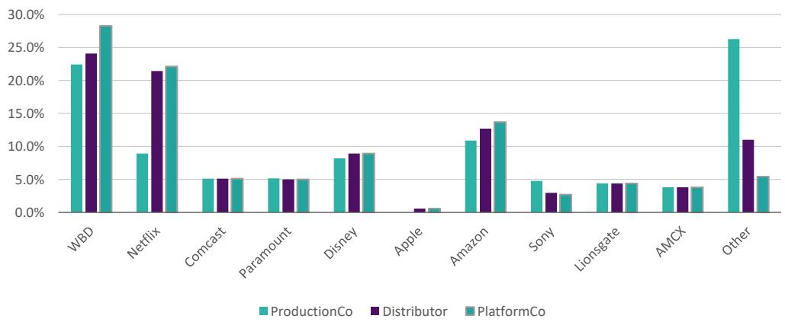

bar

| Company | ProductionCo (%) | Distributor (%) | PlatformCo (%) |
| :--- | :--- | :--- | :--- |
| WBD | 22.5 | 24.2 | 28.3 |
| Netflix | 9.0 | 21.5 | 22.3 |
| Comcast | 5.1 | 5.3 | 5.2 |
| Paramount | 5.2 | 5.1 | 5.0 |
| Disney | 8.2 | 9.1 | 9.0 |
| Apple | 0.0 | 0.7 | 0.7 |
| Amazon | 11.0 | 12.7 | 13.8 |
| Sony | 4.9 | 3.0 | 2.8 |
| Lionsgate | 4.5 | 4.5 | 4.5 |
| AMCX | 3.9 | 4.0 | 3.8 |
| Other | 26.3 | 11.1 | 5.5 |

Source: Arete Research based on IMDB MovieMeter ranking.

■ WBD came top this quarter on all metrics, continuing to highlight the value of its content.   
■ The Pitt S2 stands out as WBD's newest hit.   
Netflix came a close second, while other legacy MediaCos had a weak quarter.

Most Successful TV Shows (MovieMeter 02 Jan. '26 – 27 Mar. '26) 

<table><tr><td>Title</td><td>MovieMeter Rank Points (/325)</td><td>Rank</td><td>ProductionCo</td><td>Distributor</td><td>PlatformCo</td></tr><tr><td>The Pitt (2025–)</td><td>288</td><td>1</td><td>WBD</td><td>WBD</td><td>WBD</td></tr><tr><td>A Knight of the Seven Kingdoms (2026–)</td><td>263</td><td>2</td><td>WBD</td><td>WBD</td><td>WBD</td></tr><tr><td>Game of Thrones (2011–2019)</td><td>216</td><td>3</td><td>WBD</td><td>WBD</td><td>WBD</td></tr><tr><td>Stranger Things (2016–2025)</td><td>202</td><td>4</td><td>Netflix</td><td>Netflix</td><td>Netflix</td></tr><tr><td>Fallout (2024–)</td><td>199</td><td>5</td><td>Amazon</td><td>Amazon</td><td>Amazon</td></tr><tr><td>Breaking Bad (2008–2013)</td><td>189</td><td>6</td><td>AMCX</td><td>AMCX</td><td>AMCX</td></tr><tr><td>The Night Manager (2016–)</td><td>167</td><td>7</td><td>AMCX</td><td>AMCX</td><td>AMCX</td></tr><tr><td>Heated Rivalry (2025–)</td><td>166</td><td>8</td><td>Other</td><td>WBD</td><td>WBD</td></tr><tr><td>Landman (2024–)</td><td>150</td><td>9</td><td>Paramount</td><td>Paramount</td><td>Paramount</td></tr><tr><td>Bridgerton (2020–)</td><td>121</td><td>10</td><td>Other</td><td>Netflix</td><td>Netflix</td></tr></table>

Source: Arete Research based on IMDB MovieMeter ranking.

Platform Rankings (MovieMeter 02 Jan. '26 – 27 Mar. '26)   
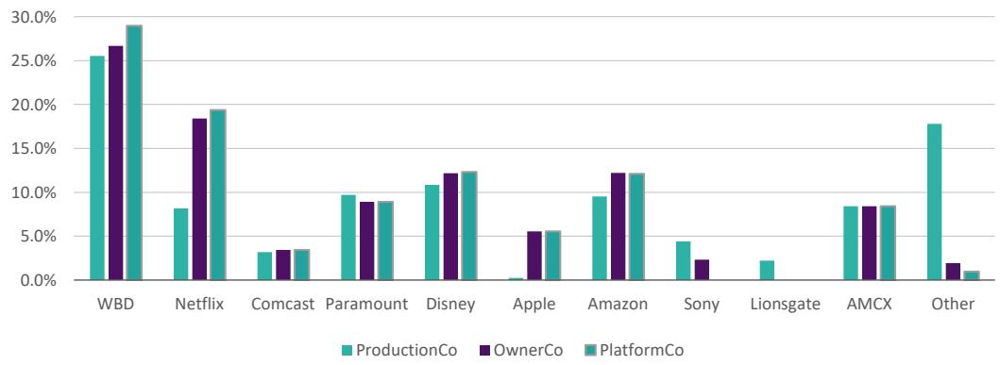

bar

| Company | ProductionCo (%) | OwnerCo (%) | PlatformCo (%) |
| :--- | :--- | :--- | :--- |
| WBD | 25.5 | 26.5 | 29.0 |
| Netflix | 8.2 | 18.4 | 19.5 |
| Comcast | 3.2 | 3.5 | 3.6 |
| Paramount | 9.8 | 9.1 | 9.1 |
| Disney | 10.9 | 12.3 | 12.4 |
| Apple | 0.3 | 5.6 | 5.7 |
| Amazon | 9.6 | 12.3 | 12.2 |
| Sony | 4.5 | 2.4 | 0.0 |
| Lionsgate | 2.2 | 0.0 | 0.0 |
| AMCX | 8.5 | 8.6 | 8.5 |
| Other | 17.9 | 1.8 | 1.0 |

Source: Arete Research based on IMDB MovieMeter ranking.

WBD won in TV shows, with the Top-3 shows of the quarter from a MovieMeter perspective.   
▪ Netflix only had two top shows, with its ranking down from the prior quarter.   
▪ It looked like a weak quarter for other MediaCos.

Most Successful Movies (MovieMeter 02 Jan. '26 – 27 Mar. '26) 

<table><tr><td>Title</td><td>MovieMeter Rank Points (/325)</td><td>Rank</td><td>ProductionCo</td><td>Distributor</td><td>PlatformCo</td></tr><tr><td>Marty Supreme (2025)</td><td>254</td><td>1</td><td>Other</td><td>Other</td><td>WBD</td></tr><tr><td>The Housemaid (2025)</td><td>249</td><td>2</td><td>Lionsgate</td><td>Lionsgate</td><td>Lionsgate</td></tr><tr><td>One Battle After Another (2025)</td><td>245</td><td>3</td><td>WBD</td><td>WBD</td><td>WBD</td></tr><tr><td>Sinners (2025)</td><td>216</td><td>4</td><td>WBD</td><td>WBD</td><td>WBD</td></tr><tr><td>Hamnet (2025)</td><td>213</td><td>5</td><td>Comcast</td><td>Comcast</td><td>Comcast</td></tr><tr><td>The Rip (2026)</td><td>158</td><td>6</td><td>Other</td><td>Netflix</td><td>Netflix</td></tr><tr><td>Bugonia (2025)</td><td>147</td><td>7</td><td>Comcast</td><td>Comcast</td><td>Comcast</td></tr><tr><td>Wuthering Heights (2026)</td><td>138</td><td>8</td><td>WBD</td><td>WBD</td><td>WBD</td></tr><tr><td>28 Years Later: The Bone Temple (2026)</td><td>123</td><td>9</td><td>Sony</td><td>Sony</td><td>Sony</td></tr><tr><td>Send Help (2026)</td><td>92</td><td>10</td><td>Disney</td><td>Disney</td><td>Disney</td></tr></table>

Source: Arete Research based on IMDB MovieMeter ranking.

Platform Rankings (MovieMeter 02 Jan. '26 – 27 Mar. '26)   
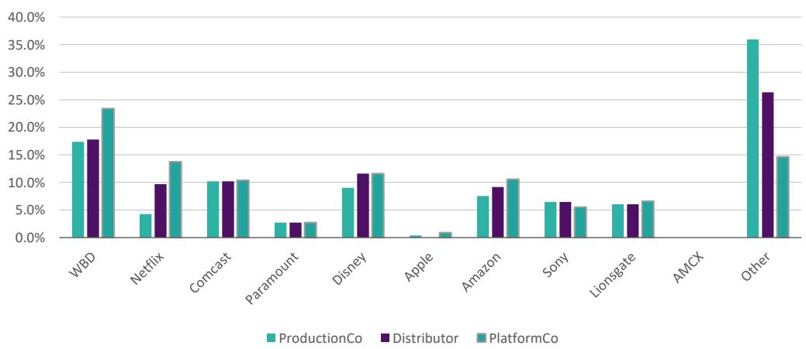

bar

| Company | ProductionCo (%) | Distributor (%) | PlatformCo (%) |
| :--- | :--- | :--- | :--- |
| WBD | 17.5 | 17.8 | 23.5 |
| Netflix | 4.3 | 9.8 | 13.8 |
| Comcast | 10.3 | 10.4 | 10.6 |
| Paramount | 2.8 | 2.9 | 2.9 |
| Disney | 9.0 | 11.7 | 11.8 |
| Apple | 0.5 | 0.0 | 1.0 |
| Amazon | 7.5 | 9.2 | 10.7 |
| Sony | 6.5 | 6.6 | 5.7 |
| Lionsgate | 6.0 | 6.0 | 6.6 |
| AMCX | 0.0 | 0.0 | 0.0 |
| Other | 36.0 | 26.2 | 14.8 |

Source: Arete Research based on IMDB MovieMeter ranking.

▪ 1Q26 was a relatively unimportant box office quarter, lacking in high-budget releases.   
▪ Most of the movies topping the MovieMeter came from late '25.   
▪ WBD continues to perform very well in Movies.

Top-25 Planned Releases of 2Q26 Ranked by MovieMeter 

<table><tr><td>Rank</td><td>Title</td><td>MovieMeter</td><td>Platform</td><td>Date</td></tr><tr><td>1</td><td>Masters of the Universe</td><td>27</td><td>Amazon</td><td>04-Jun</td></tr><tr><td>2</td><td>BEEF (Season 2)</td><td>102</td><td>Netflix</td><td>16-Apr</td></tr><tr><td>3</td><td>Turn of the Tide (S3)</td><td>196</td><td>Netflix</td><td>10-Apr</td></tr><tr><td>4</td><td>Thrash</td><td>248</td><td>Netflix</td><td>10-Apr</td></tr><tr><td>5</td><td>Cape Fear (Season 1)</td><td>257</td><td>Apple TV</td><td>05-Jun</td></tr><tr><td>6</td><td>Dutton Ranch (Season 1)</td><td>265</td><td>Paramount+</td><td>15-May</td></tr><tr><td>7</td><td>Hacks (S5)</td><td>328</td><td>HBO Max</td><td>09-Apr</td></tr><tr><td>8</td><td>Stranger Things: Tales from &#x27;85 (Season 1)</td><td>432</td><td>Netflix</td><td>23-Apr</td></tr><tr><td>9</td><td>The Dark Wizard (S1)</td><td>459</td><td>HBO Max</td><td>14-Apr</td></tr><tr><td>10</td><td>The Sheep Detectives</td><td>469</td><td>Amazon</td><td>07-May</td></tr><tr><td>11</td><td>APEX</td><td>503</td><td>Netflix</td><td>24-Apr</td></tr><tr><td>12</td><td>Margo&#x27;s Got Money Troubles (Season 1)</td><td>650</td><td>Apple TV</td><td>15-Apr</td></tr><tr><td>13</td><td>Big Mistakes (S1)</td><td>725</td><td>Netflix</td><td>09-Apr</td></tr><tr><td>14</td><td>Widow&#x27;s Bay (Season 1)</td><td>735</td><td>Apple TV</td><td>28-Apr</td></tr><tr><td>15</td><td>The Miniature Wife (S1)</td><td>804</td><td>Peacock</td><td>09-Apr</td></tr><tr><td>16</td><td>Off Campus</td><td>822</td><td>Amazon</td><td>13-May</td></tr><tr><td>17</td><td>Outcome</td><td>842</td><td>Apple</td><td>10-Apr</td></tr><tr><td>18</td><td>Spider-Noir (Season 1)</td><td>982</td><td>Amazon</td><td>27-May</td></tr><tr><td>19</td><td>Avatar the Last Airbender (Season 2)</td><td>1242</td><td>Netflix</td><td>25-Jun</td></tr><tr><td>20</td><td>Star City (S1)</td><td>1283</td><td>Apple</td><td>29-May</td></tr><tr><td>21</td><td>Rivals (Season 2)</td><td>1345</td><td>Hulu</td><td>15-May</td></tr><tr><td>22</td><td>Running Point (Season 2)</td><td>1600</td><td>Netflix</td><td>23-Apr</td></tr><tr><td>23</td><td>Sugar (Season 2)</td><td>2143</td><td>Apple TV</td><td>19-Jun</td></tr><tr><td>24</td><td>Man on Fire (Season 1)</td><td>2248</td><td>Netflix</td><td>30-Apr</td></tr><tr><td>25</td><td>Tom Clancy&#x27;s Jack Ryan: Ghost War</td><td>2367</td><td>Amazon</td><td>20-Jun</td></tr></table>

Source: Arete Research based on IMDB MovieMeter ranking, flixpatrol.com

▪ Netflix has ramped releases, leading to a 57% share of planned releases in 2Q26, up from 43% in 4Q.   
▪ Other platforms also lowered planned releases,Ci notably Paramount and HBO Max.   
▪ Netflix has 10 out of the Top-25 releases (i.e., 40%),b which is not especially high relative to the past. Netflix still seems to be pursuing quantity, while others seem to be more focused on quality.

International Streaming Services App Ranking, weekly (09 Jan. '26 – 20 Mar. '26)   
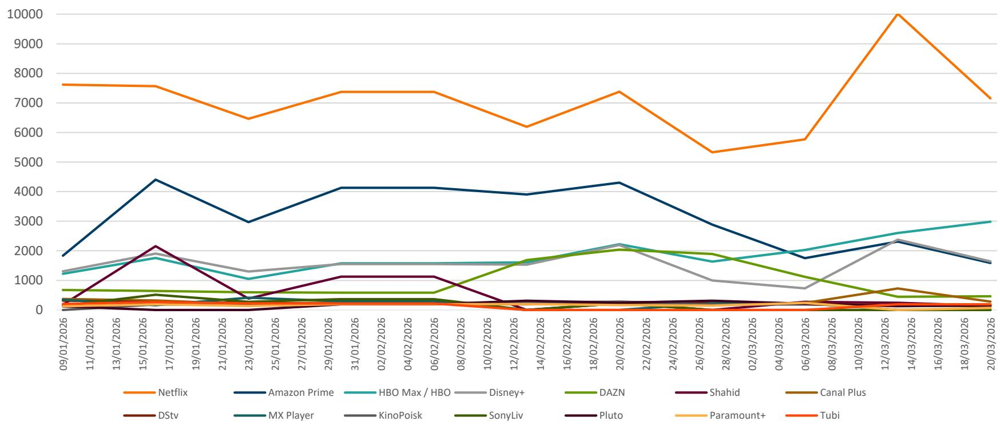

line

| Date       | Netflix | Amazon Prime | HBO Max / HBO | Disney+ | DAZN | Shahid | Canal Plus | DStv | MX Player | KinoPoisk | SonyLiv | Pluto | Paramount+ | Tubi |
|------------|---------|--------------|---------------|---------|------|--------|------------|------|-----------|-----------|---------|-------|------------|------|
| 09/01/2026 | 7600    | 1800         | 1200          | 1300    | 600  | 300    | 200        | 100  | 100       | 100       | 100     | 100   | 100        | 100  |
| 11/01/2026 | 7600    | 2500         | 1400          | 1400    | 600  | 300    | 200        | 100  | 100       | 100       | 100     | 100   | 100        | 100  |
| 13/01/2026 | 7600    | 3500         | 1600          | 1600    | 600  | 300    | 200        | 100  | 100       | 100       | 100     | 100   | 100        | 100  |
| 15/01/2026 | 7600    | 4400         | 1700          | 1700    | 600  | 2100   | 200        | 100  | 100       | 100       | 100     | 100   | 100        | 100  |
| 17/01/2026 | 7600    | 4400         | 1700          | 1700    | 600  | 2100   | 200        | 100  | 100       | 100       | 100     | 100   | 100        | 100  |
| 19/01/2026 | 7600    | 4400         | 1700          | 1700    | 600  | 2100   | 200        | 100  | 100       | 100       | 100     | 100   | 100        | 100  |
| 21/01/2026 | 7600    | 4400         | 1700          | 1700    | 600  | 2100   | 200        | 100  | 100       | 100       | 100     | 100   | 100        | 100  |
| 23/01/2026 | 6500    | 3000         | 1000          | 1200    | 600  | 300    | 200        | 100  | 100       | 100       | 100     | 100   | 100        | 100  |
| 25/01/2026 | 7000    | 3500         | 1100          | 1300    | 600  | 400    | 200        | 100  | 100       | 100       | 100     | 100   | 100        | 100  |
| 27/01/2026 | 7200    | 3800         | 1200          | 1400    | 600  | 500    | 200        | 100  | 100       | 100       | 100     | 100   | 100        | 100  |
| 29/01/2026 | 7400    | 4100         | 1300          | 1500    | 600  | 1100   | 200        | 100  | 100       | 100       | 100     | 100   | 100        | 100  |
| 31/01/2026 | 7400    | 4100         | 1300          | 1500    | 600  | 1100   | 200        | 100  | 100       | 100       | 100     | 100   | 100        | 100  |
| 02/02/2026 | 7400    | 4100         | 1300          | 1500    | 600  | 1100   | 200        | 100  | 100       | 100       | 100     | 100   | 100        | 100  |
| 04/02/2026 | 7400    | 4100         | 1300          | 1500    | 600  | 1100   | 200        | 100  | 100       | 100       | 100     | 100   | 100        | 100  |
| 06/02/2026 | 7400    | 4100         | 1300          | 1500    | 600  | 1100   | 200        | 100  | 100       | 100       | 100     | 100   | 100        | 100  |
| 08/02/2026 | 7400    | 4100         | 1300          | 1500    | 600  | 1100   | 200        | 100  | 100       | 100       | 100     | 100   | 100        | 100  |
| 10/02/2026 | 7400    | 4100         | 1300          | 1500    | 600  | 1100   | 200        | 100  | 100       | 100       | 100     | 100   | 100        | 100  |
| 12/02/2026 | 7400    | 4100         | 1300          | 1500    | 600  | 1100   | 200        | 100  | 100       | 100       | 100     | 100   | 100        | 100  |
| 14/02/2026 | 7400    | 4100         | 1300          | 1500    | 600  | 1100   | 200        | 100  | 100       | 100       | 100     | 100   | 100        | 100  |
| 16/02/2026 | 7400    | 4100         | 1300          | 1500    | 600  | 1100   | 200        | 100  | 100       | 100       | 100     | 100   | 100        | 100  |
| 18/02/2026 | 7400    | 4100         | 1300          | 1500    | 600  | 1100   | 200        | 100  | 100       | 100       | 100     | 100   | 100        | 100  |
| 20/02/2026 | 7400    | 4100         | 1300          | 1500    | 600  | 1100   | 200        | 100  | 100       | 100       | 100     | 100   | 100        | 100  |
| 22/02/2026 | 7400    | 4100         | 1300          | 1500    | 600  | 1100   | 200        | 100  | 100       | 100       | 100     | 100   | 100        | 100  |
| 24/02/2026 | 7400    | 4100         | 1300          | 1500    | 600  | 1100   | 200        | 100  | 100       | 100       | 100     | 100   | 100        | 100  |
| 26/02/2026 | 7400    | 4100         | 1300          | 1500    | 600  | 1100   | 200        | 100  | 100       | 100       | 100     | 100   | 100        | 100  |
| 28/02/2026 | 7400    | 4100         | 1300          | 1500    | 600  | 1100   | 200        | 100  | 100       | 100       | 100     | 100   | 100        | 100  |
| 02/03/2026 | 7400    | 4100         | 1300          | 1500    | 600  | 1100   | 200        | 100  | 100       | 100       | 100     | 100   | 100        | 100  |
| 04/03/2026 | 7400    | 4100         | 1300          | 1500    | 600  | 1100   | 200        | 100  | 100       | 100       | 100     | 100   | 100        | 100  |
| 06/03/2026 | 7400    | 4100         | 1300          | 1500    | 600  | 1100   | 200        | 100  | 100       | 100       | 100     | 100   | 100        | 100  |
| 08/03/2026 | 7400    | 4100         | 1300          | 1500    | 600  | 1100   | 200        | 100  | 100       | 100       | 100     | 100   | 100        | 100  |
| 10/03/2026 | 7400    | 4100         | 1300          | 1500    | 600  | 1100   | 200        | 100  | 100       | 100       | 100     | 100   | 100        | 100  |
| 12/03/2026 | 7400    | 4100         | 1300          | 1500    | 600  | 1100   | 200        | 100  | 100       | 100       | 100     | 100   | 100        | 100  |
| 14/03/2026 | 7400    | 4100         | 1300          | 1500    | 600  | 1100   | 200        | 100  | 100       | 100       | 100     | 100   | 100        | 100  |
| 16/03/2026 | 7400    | 4100         | 1300          | 1500    | 600  | 1100   | 200        | 100  | 100       | 100       | 100     | 100   | 100        | 100  |
| 18/03/2026 | 7400    | 4100         | 1300          | 1500    | 600  | 1100   | 200        | 100  | 100       | 100       | 100     | 100   | 100        | 100  |
| 20/03/2026 | 7400    | 4100         | 1300          | 1500    | 600  | 1100   | 200        | 100  | 100       | 100       | 100     | 100   | 100        | 100  |

Source: FlixPatrol.

▪ Netflix remains the top service in most countries around the world. As was evident in US data, it took share around the world, too.   
▪ HBO Max took the #2 spot, boosted by international launches in the UK, Germany and Italy.

# Linear and Sports Analysis

# 1Q26 F1 Viewership Trends

Apple Viewership Surpasses ESPN for Opener   
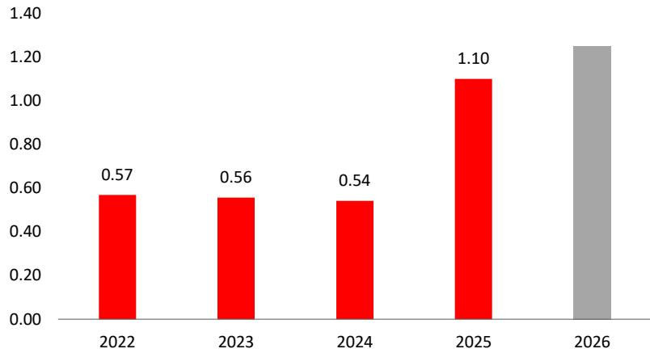

bar

| Year | Value |
| :--- | :--- |
| 2022 | 0.57 |
| 2023 | 0.56 |
| 2024 | 0.54 |
| 2025 | 1.10 |
| 2026 | 1.25 |

Source: Nielsen for historic ESPN viewership and Apple for commentary on '26 Australian GP.

Japanese GP Viewership Mixed in Europe   
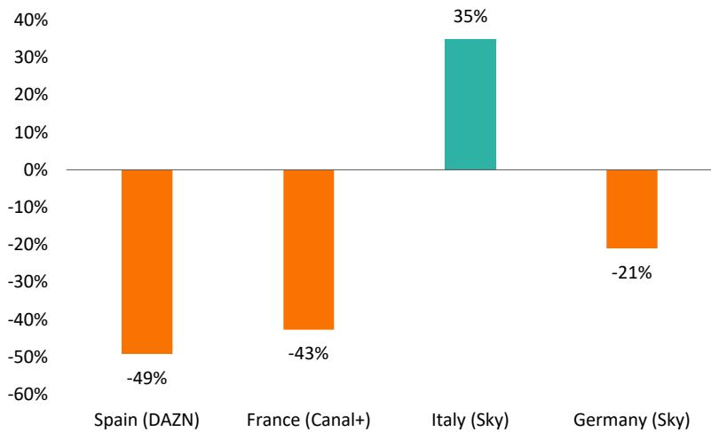

bar

| Region | Value (%) |
| :--- | :--- |
| Spain (DAZN) | -49 |
| France (Canal+) | -43 |
| Italy (Sky) | 35 |
| Germany (Sky) | -21 |

Source: European media outlets, Formula1 God and thejudge13.com.

▪ Australian GP US viewership figures suggests that concerns around the potential for lower engagement on Apple TV were misplaced:

Apple's Eddy Cue confirmed that Apple's opening race viewership exceeded ESPN's 1.1m viewership (Nielsen).   
Both '25 and '26 Australian GPs were "season openers" and so seem to us like a fair lfl comparison.   
Apple TV seems to be supporting US engagement growth vs. concerns about F1 races going behind Apple's paywall.

▪ Expect the Miami GP (4 May) to be the first "free-to-air" race on Apple TV, likely heavily marketed, and providing the first comparison vs. ABC broadcast viewership last season.   
▪ Recent media reports (e.g., gpfans.com) suggest that European viewership has been "mixed" given the new regulations (e.g., Japan GP – lower chart).   
▪ Too early to judge the impact of new regulations on viewership, given the planned regs evolution over the season. There have more overtakes, but fans are critical of battery deployment vs. driver skill overtaking ("Mario Kart racing"), with notable driver dissatisfaction (e.g., Verstappen). Key also will be whether Mercedes dominates the field.   
▪ From an economic perspective, there is plenty of time for F1 to respond with regs adjustments given 5-7 years of contracted revenues.   
▪ Iran conflict resulted in cancellation of Bahrain and Saudi GPs.

# F1 GP Attendance & Ticket Prices

F1 Race Attendance & Ticket Price Growth 

<table><tr><td rowspan="2">Formula 1 GP</td><td colspan="2">Race attendance</td><td>Ticket prices</td><td>P x Q</td></tr><tr><td>vs. &#x27;25</td><td>vs. pre-Covid</td><td>vs. &#x27;25</td><td>vs. &#x27;25</td></tr><tr><td>Australia</td><td>+4.0%</td><td>+49.3%</td><td>+8.2%</td><td>+12.5%</td></tr><tr><td>China</td><td>+4.5%</td><td>+43.8%</td><td>+14.0%</td><td>+19.2%</td></tr><tr><td>Japan</td><td>+18.4%</td><td>+118.0%</td><td>-1.6%</td><td>+16.5%</td></tr><tr><td>ytd average</td><td>+9.0%</td><td>+70.4%</td><td>+6.9%</td><td>+16.1%</td></tr></table>

Source: F1 GP hosting organisations, Statista, F1Destinations.com, Arete Research.

F1 1Q26 Weekend Race Attendance (000s)   
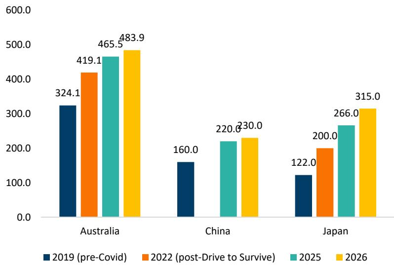

bar

| Country | 2019 (pre-Covid) | 2022 (post-Drive to Survive) | 2025 | 2026 |
| :--- | :--- | :--- | :--- | :--- |
| Australia | 324.1 | 419.1 | 465.5 | 483.9 |
| China | 160.0 | | 220.0 | 230.0 |
| Japan | 122.0 | 200.0 | 266.0 | 315.0 |

Source: F1 GP hosting organisations, F1Destinations.com.

▪ We set out in F1 Ecosystem Update ('26 ed.) (Jan. '26) how we see F1 being in the midst of an accelerated race promotion cycle as new and renewed contracts land across '25-'27E.   
▪ Race promoter economics continue to result in intense competition to host GPs and to bring higher fees.   
▪ F1 race attendance increased 9% yoy in 1Q vs. '25 and is up >70% vs. pre-Covid levels.   
▪ Ticket prices increased significantly ahead of inflation, with the Japanese GP decline reflecting ¥-depreciation vs. \$ (data is in \$).   
▪ Chinese GP promoter took price for the first time since racing returned to the calendar in '24. See a meaningful step-up in race fee for the new contract starting in '26.   
▪ Race promotion revenues grew 15-20% yoy in 1Q26E, per our analysis.   
▪ On a 3-year view, Australia/Japan promoter revs. increased +55%/+85%, respectively, with contract extensions landing in '26/'25. Chinese promoter revs. are up >25% vs. two years ago.

# UFC Viewership and Numbered Event Gates

UFC Viewership Summary 1Q26 (millions)   
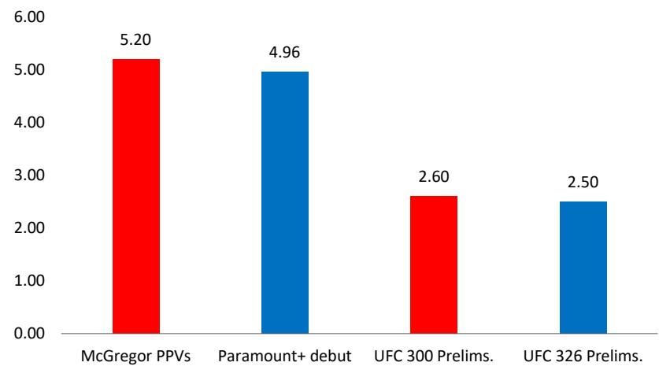

bar

| Category | Value |
| :--- | :--- |
| McGregor PPVs | 5.20 |
| Paramount+ debut | 4.96 |
| UFC 300 Prelims. | 2.60 |
| UFC 326 Prelims. | 2.50 |

Source: Nielsen, ESPN, Paramount and Sports Business Journal.

# UFC Numbered Event Attendance & Gross Gate

(\$m)From left to right:   
Numbered event attendance; Gross gate implied average ticket price 

<table><tr><td></td><td colspan="3">1Q25</td><td colspan="4">1Q26</td></tr><tr><td>UFC 311</td><td>18,370</td><td>$10.2m</td><td>$555</td><td>UFC 324</td><td>19,480</td><td>$11.0m</td><td>$560</td></tr><tr><td>UFC 312</td><td>18,255</td><td>$7.7m</td><td>$420</td><td>UFC 325</td><td>18,100</td><td>$10.1m</td><td>$560</td></tr><tr><td>UFC 313</td><td>19,775</td><td>$15.0m</td><td>$760</td><td>UFC 326</td><td>19,480</td><td>$8.3m</td><td>$425</td></tr><tr><td>Total</td><td>56,400</td><td>$32.9m</td><td>$585</td><td></td><td>57,060</td><td>$29.4m</td><td>$515</td></tr><tr><td colspan="4">% yoy growth</td><td></td><td>1.2%</td><td>-10.9%</td><td>-12.0%</td></tr></table>

Source: TKO Group and tapology.com.

▪ UFC viewership is off to a strong start on CBS/Paramount+ for its new 7-year \$1.1bn AAV rights agreement – this points to meaningful sponsorship opportunity for UFC on higher domestic viewership.   
▪ Paramount reported 4.96m average viewership for its debut numbered fight event (UFC 324) on Paramount+ (n.b., Paramount+ has dropped PPV for numbered events in the US).   
▪ This viewership across US and Latin America is broadly comparable with "behind PPV paywall" global viewership for historic McGregor fights (UFC's highest viewership fighter historically), assuming 3.5 viewers per PPV for McGregor fights (averaging 1.5m PPVs/fight).   
▪ With typical PPVs <500k in the ESPN era (= 1.5-2m domestic), we think this points to a significant step-up for main card numbered event viewership in the US.   
▪ Expect viewership to taper/normalise slightly from the debut night, as we saw with WWE's Monday Night Raw on Netflix.   
▪ CBS "prelims" viewership looks similarly strong on debut – UFC 326 prelims on CBS averaged \~2.5m viewership in US, comparable with ESPN's Apr. '24 high for UFC 300, which was broadcast across ESPN, ESPN+ and Hulu SVOD.   
▪ Lower table shows Live Events revenue trends in 1Q26. Expecting stable attendance for numbered events but slightly weaker ticket pricing. The resulting low-teens decline implied for Live Events revenue is also reflected in consensus.

# WWE Viewership Trends

1Q26 Monday Night Raw Viewership (millions)   
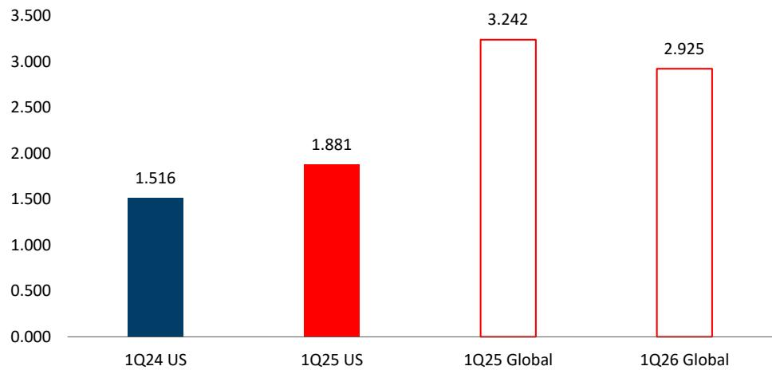

bar

| Category | Value |
| :--- | :--- |
| 1Q24 US | 1.516 |
| 1Q25 US | 1.881 |
| 1Q25 Global | 3.242 |
| 1Q26 Global | 2.925 |

Source: Nielsen, USA Network, Nielsen/VideoAmp ests. and Netflix.

1Q Friday Night Smackdown Viewership (millions)   
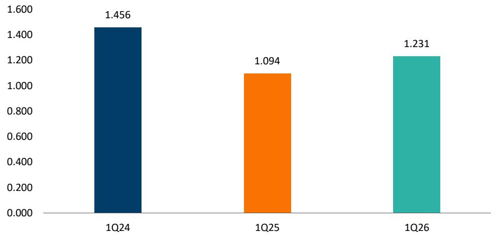

bar

| Quarter | Value |
| ------- | ----- |
| 1Q24    | 1.456 |
| 1Q25    | 1.094 |
| 1Q26    | 1.231 |

Source: Nielsen, USA Network, Wrestlenomics.

▪ Monday Night Raw premiered on Netflix on 6 Jan. '25, having previously aired on USA Network.   
1 After a strong 1Q25 (1.9m average US viewership), Netflix Raw viewership trended lower, settling at \~1.5m per show, broadly consistent with prior cable viewership.   
▪ Can access global household viewership when Raw hits a Top 10 Netflix ranking:

Global Raw viewership fell \~10% yoy in 1Q26.   
Only 4 Raw shows made the Top-10 vs. 12 in 1Q25.

▪ Lower chart shows Friday Night Smackdown viewership on USA Network.

Smackdown viewership grew 12.5% yoy in 1Q26.   
Remains structurally lower than it was on Fox Sports in 1Q24.

Quarterly Cable Audience by MediaCo (Average Qly Audience, Prime Time, P2+ Viewers 000s)   
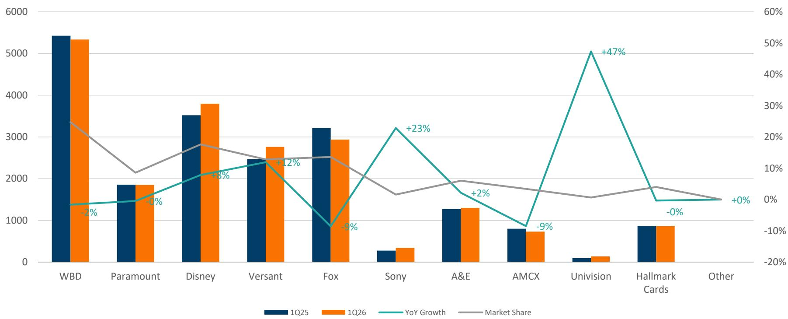

bar_line

| Company | 1Q25 | 1Q26 | YoY Growth (%) | Market Share (%) |
| :--- | :--- | :--- | :--- | :--- |
| WBD | 5450 | 5350 | -2 | 34 |
| Paramount | 1850 | 1850 | -0 | 21 |
| Disney | 3500 | 3800 | 18 | 28 |
| Versant | 2400 | 2750 | 12 | 24 |
| Fox | 3200 | 2950 | -9 | 24 |
| Sony | 300 | 350 | 23 | 15 |
| A&E | 1250 | 1300 | 2 | 19 |
| AMCX | 800 | 750 | -9 | 15 |
| Univision | 100 | 150 | 47 | 1 |
| Hallmark Cards | 850 | 850 | -0 | 17 |
| Other | 0 | 0 | 0 | 0 |

Source: USTVDB, Arete Research.

While Neilsen didn't adjust their streaming data, they did adjust linear data for the new panel demographics and technology. This resulted in a sizeable increase in stated linear viewing, which cannot be adjusted in the orange historical data in the chart above.   
Hard to take too much from this data, other than it is wrong to assume that, for example, Versant's rating was +12% yoy ! Worth noting that while Versant viewership benefited from the Winter Olympics, Comcast retained the bulk of the Olympics economics, simply renting space on USA Network.   
Worth noting that Fox seems to have had a weak quarter (-9% on non-lfl data) given a difficult post-election comp in 1Q25.   
Market share variations between the cable networks looked relatively minor in the scheme of historical data.

# The Box Office

# Box Office Performance & Outlook

Qtly. Domestic Box Office Projections and Growth   
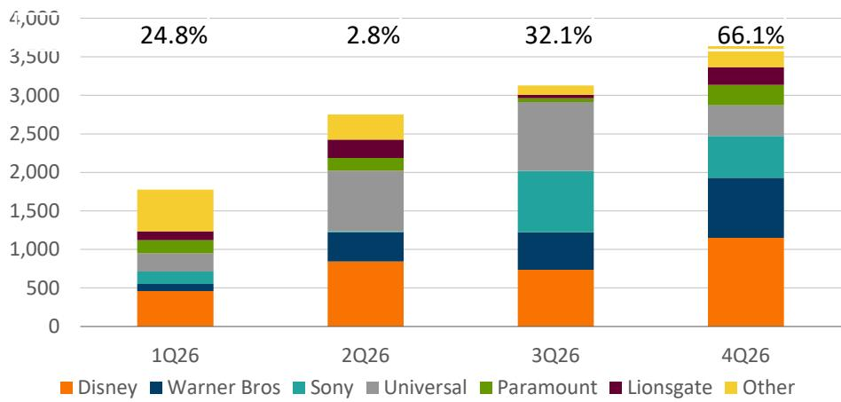

bar_stacked

| Quarter | Disney | Warner Bros | Sony | Universal | Paramount | Lionsgate | Other |
|---------|--------|-------------|------|-----------|-----------|-----------|-------|
| 1Q26    | 500    | 100         | 100  | 200       | 100       | 100       | 500   |
| 2Q26    | 800    | 300         | 0    | 600       | 100       | 200       | 300   |
| 3Q26    | 700    | 400         | 600  | 700       | 100       | 100       | 100   |
| 4Q26    | 1100   | 500         | 400  | 300       | 200       | 100       | 100   |

Source: IMDB, The Numbers, Arete Research estimates.

▪ North American Box Office receipts were up +25% yoy in 1Q26. This was despite a weak slate from majors as independent studios picked up the slack.   
▪ This quarter was a good quarter for Comcast, driven by Super Mario Galaxy grossing >\$600m so far against a \$100m budget.   
▪ Overall, Box Office is performing above expectations driven by independent Studios and Comcast having the only hit movie, and likely a profitable quarter.

4Q25 WW Gross vs. Budget by Distributor   
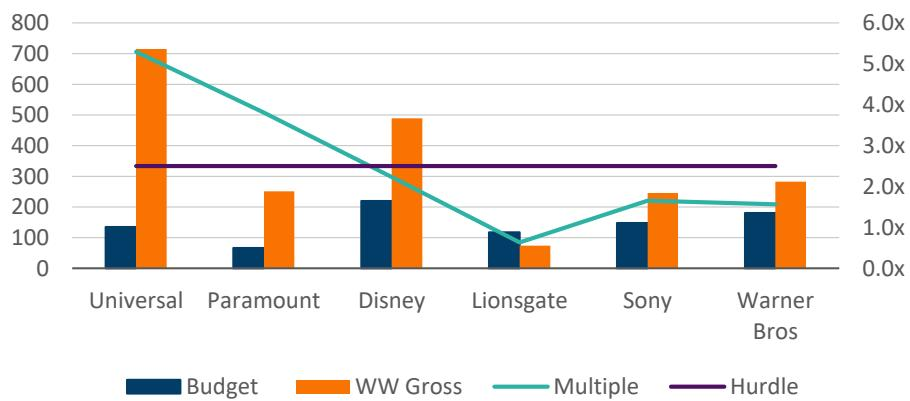

bar_line

| Studio | Budget | WW Gross | Multiple | Hurdle |
| :--- | :--- | :--- | :--- | :--- |
| Universal | 135 | 715 | 5.5 | 3.0 |
| Paramount | 65 | 250 | 4.0 | 3.0 |
| Disney | 215 | 485 | 2.5 | 3.0 |
| Lionsgate | 115 | 65 | 0.8 | 3.0 |
| Sony | 145 | 240 | 1.5 | 3.0 |
| Warner Bros | 175 | 280 | 1.5 | 3.0 |

Source: IMDB, The Numbers, Arete Research estimates.

# Key Insights

# Stocks Mentioned in This Report

<table><tr><td>Company</td><td>Ticker</td><td>Share price</td><td>Rating</td><td>Price Target</td><td>Implied Upside</td></tr><tr><td>Alphabet</td><td>GOOG-US</td><td>$337</td><td>Buy</td><td>$405</td><td>+20%</td></tr><tr><td>Amazon</td><td>AMZN-US</td><td>$249</td><td>Buy</td><td>$285</td><td>+14%</td></tr><tr><td>Apple</td><td>AAPL-US</td><td>$266</td><td>Buy</td><td>$305</td><td>+15%</td></tr><tr><td>Comcast Corp.</td><td>CMCSA-US</td><td>$28.30</td><td>Sell</td><td>$23</td><td>-18%</td></tr><tr><td>Formula One Group</td><td>FWONK-US</td><td>$90.47</td><td>Buy</td><td>$125</td><td>+38%</td></tr><tr><td>Fox Corporation</td><td>FOXA-US</td><td>$63.66</td><td>Buy</td><td>$97</td><td>+52%</td></tr><tr><td>Netflix</td><td>NFLX-US</td><td>$108</td><td>Buy</td><td>$116 (previously $110)</td><td>+8%</td></tr><tr><td>Paramount Skydance</td><td>PSKY-US</td><td>$11.67</td><td>Neutral</td><td>$14</td><td>+17%</td></tr><tr><td>Roku</td><td>ROKU-US</td><td>$109</td><td>Buy</td><td>$133</td><td>+22%</td></tr><tr><td>Sony Group Corp</td><td>6758-JP</td><td>¥3,402</td><td>Buy</td><td>¥5,570</td><td>+64%</td></tr><tr><td>The Walt Disney Company</td><td>DIS-US</td><td>$103</td><td>Sell</td><td>$77</td><td>-25%</td></tr><tr><td>TKO Group</td><td>TKO-US</td><td>$193</td><td>Neutral</td><td>$185</td><td>-4%</td></tr><tr><td>Versant Media</td><td>VSNT-US</td><td>$41.00</td><td>Sell</td><td>$36 (previously $33)</td><td>-12%</td></tr><tr><td>Warner Bros. Discovery</td><td>WBD-US</td><td>$27.20</td><td>Neutral</td><td>$31.25</td><td>+15%</td></tr></table>

Source: Arete Research, FactSet for share prices (as of 15 Apr. '26).

We increase our price target for Netflix to \$116 in '26E (previously \$110) as a result of factoring-in late-March price increases, currency impact, and other minor estimate adjustments. Our price target is based on a 50/50 blend of multiples (average of forward multiples in '27E – 27.5x P/E, 30x P/FCF, 22.5x EV/EBITDA – discounted back to YE'26E) and DCF (WACC 8.5%/PGR 3%).   
We increase our price target for Versant to \$36 in '27E (previously \$33) as a result of factoring in 4Q25 results. Our price target remains based on 3.5x EV/EBITDA in ‘27E, less net debt in '27E, divided by YE27E share count assuming buybacks.

# Netflix's Slate Still Looks Good But It Will Face Tough Comps in 2H26:

Netflix's share of the Top-20 shows dropped from 46% to 40% even as viewership continued to grow (+14% yoy).   
While Netflix’s share of releases is increasing in 2Q26 to 57%, it has only 40% of the Top-25 most-anticipated shows. Netflix is ramping production volumes to fill gaps. We reckon that its dominance in 4Q25 should not be extrapolated forward, even if Netflix held share over the past two years, as competition continues to rise with generally better-funded rivals.

# WBD Continues to Win in Content Terms:

WBD dominated MovieMeter rankings across all titles, and both TV shows and Movies in 1Q26, with The Pitt S2 emerging as a multi-season blockbuster. Its Top-20 viewership grew 84% this quarter. PSKY is buying a healthy studio.   
HBO Max launched in European markets driving it to #2 global streaming according to FlixPatrol.   
• Combining WBD and Paramount creates a market with 4 main players (Disney, PSKY, Netflix, Amazon): What does Comcast do?

# Content Production Is Ramping to Pre-Strike Levels; Competition Is Rising Once Again:

• Titles in production accelerated in 1Q26 with the sector approaching the '23, pre-strike, peak production.   
. Paramount and WBD are lowering production as they get ready to merge.   
With increasing margins, continued revenue growth and improved balance sheets, the threat of heightened competitive intensity is a real risk, in our view.

# Nielsen's Measurement Changes Implies More Growth Ahead for Streaming:

Nielsen changed its panel sources and technology, delaying The Gauge data for March. According to the WSJ, the new measures put streaming share 6ppts lower (now 42%).   
This creates issues in the future for yoy comps and makes linear ratings hard to extrapolate from. Notably, Fox seems to have faced a tough comp and a sizeable ratings decline even with the boost to linear viewing from the methodology change.

# F1 Transition to Apple TV Had Higher Opener Viewing; Step Change in TKO's UFC Viewing With PSKY:

Australian GP US viewing above ESPN levels for the season opener. With Bahrain/Saudi cancelled, next test will be Miami GP, which is expected to be Apple's first FTA race, competing with ABC broadcast last year. Jury out on new F1 regs. viewing impact.   
• UFC's CBS/Paramount+ debut brought a step-change in US viewership – \~5m avg. for numbered events vs. 1.5-2m EPSN PPVs.

<table><tr><td>Alphabet - BUY</td><td>YouTube share gains continued to stall even if reaching ATHs in viewership.</td></tr><tr><td>Amazon - BUY</td><td>Prime Video continues to outspend the competition and make in-roads in terms of hits.</td></tr><tr><td>Apple - BUY</td><td>Apple TV continues to apply the HBO playbook.</td></tr><tr><td>Comcast - SELL</td><td>Peacock gained 218bps of streaming share in February (likely NFL/Olympics driven) but structurally will have to find a solution beyond sports rights. Super Mario Galaxy was the box office hit of the quarter (&gt;$600M on $100M budget).</td></tr><tr><td>Fox Corporation - BUY</td><td>Tubi&#x27;s growth appears to have stalled for now. Fox News had a tough comp in 1Q26.</td></tr><tr><td>Formula One Group - BUY</td><td>Apple seems to be driving engagement growth for F1. Ticket prices increased above inflation. Attendance up +9% in 1Q26.</td></tr><tr><td>Netflix - Buy</td><td>Stranger Things final season carried another quarter for Netflix, but the pipeline now looks thinner, with management compensating via catalogue expansion.</td></tr><tr><td>Paramount Skydance - NEUTRAL</td><td>Sequentially worse quarter for Paramount+. Also a weak Box Office.</td></tr><tr><td>Roku - BUY</td><td>Roku channel continues to grow.</td></tr><tr><td>Sony Group - BUY</td><td>Looking like &#x27;26 on track to be a great year for the Pictures division with a strong slate.</td></tr><tr><td>The Walt Disney Company - SELL</td><td>Disney+ was down 7% and Hulu down 60% in Top-20 viewership yoy. Disney+ and Hulu are starting to ramp their catalogues once again.</td></tr><tr><td>TKO Group Holdings - NEUTRAL</td><td>UFC&#x27;s CBS/Paramount+ debut brought a step-change in domestic viewership — ~5m average for numbered events vs. estimated 1.5-2m PPVs during the ESPN era.</td></tr><tr><td>Versant Media - SELL</td><td>Versant hard to extrapolate from Nielsen data given viewership metric changes. Rating benefited from Winter Olympics although limited economic effect (space rented by Comcast).</td></tr><tr><td>Warner Bros. Discovery - Neutral</td><td>The content winner in 1Q26, topping MovieMeter rankings in all categories. HBO Max grew 84% yoy in Top-20 viewership and now offers the best cost-per-hit at its price point. Launch in the UK, Germany, Italy resulted in #2 global streaming service per FlixPatrol data.</td></tr></table>

Regulation AC - The research analyst(s) whose name(s) appear(s) on the front cover of this report certify that: all of the views expressed in this report accurately reflect their personal views about the subject company or companies and its or their securities, and that no part of their compensation was, is, or will be, directly or indirectly, related to the specific recommendations or views expressed in this report.

Sector Risks. The telecoms and cable industries are competitive and regulated, as well as impacted by political and antitrust decisions. In Europe, this is a mature industry often characterized by declining revenues in both wireline and wireless, which companies attempt to offset by cost reduction. In the US, competition is rising in wireless and broadband as the industry matures, while cord-cutting and streaming are disrupting the video business, increasing uncertainty overC financial performance. Emerging market telecoms are also in a maturing phase. Large telecoms and cable companies are often sprawling groups, and in some cases poorly-managed. Technological change and the entry of other over-the-top players into telecoms markets are additional factors leading to uncertainty over the industry's financial results. The US media industry is characterised by changing consumer behaviour with traditional linear TV and theatrical consumption being replaced new streaming models. These streaming businesses are typically global and often require heavy investment, and so far producing lower returnsi than was historically the case in the linear TV era. There has been a race to build new streaming content at significant expense, while consumers seem to churn between streamers chasing the shows/movies of the moment; making for a competitive industry. This streaming investment and competition adds to financial performances risks and raises the level of capital needed to be successful.

Primary Analyst(s) Coverage Group: AT&T, Autostore Holdings, BT Group, Charter Communications, Cipher Digital, Comcast, Coreweave, Core Scientific,ly Deutsche Telekom, DraftKings, Flutter Entertainment, Formula One Group, Fox Corporation, Genius Sports, HUT 8, IREN, Liberty Global, Nebius Group, Netflix, ol Ocado Group, Orange, Paramount Skydance, RIOT Platforms, SoftBank Group Corp., Sportradar, Sunrise Communications, Symbotic, Telecom Italia, Telefonica, eds TKO Group Holdings, T-Mobile US, TeraWulf, Verizon Communications, Versant Media, Vodafone, Walt Disney Company, Warner Bros. Discovery. d

Potential Conflicts: Formula One Group, Fox Corp. – The analyst or a member of the analyst's household owns equity securities in this company.

For important disclosure information regarding the companies in this report, please call +44 (0)207 959 1300, or send an email to allison.kraver@arete.net.

Rating System: Buy (B), Neutral (N) and Sell (S) – A Buy-rated stock is projected to outperform the analyst’s industry coverage universe and rise in price over the next 12 months. A Neutral-rated stock is projected to perform in line with the analyst’s industry coverage universe over the next 12 months. A Sell-rated stock is projected to underperform the analyst’s industry coverage universe and decline in price over the next 12 months. Being assigned a Buy or Sell rating is determined by a stock's absolute return potential, related investment risks and other factors, which may include share liquidity, debt refinancing, estimate risk, economic outlook of principal countries of operation, or other company, political, regulatory, competitive, technological or industry considerations. A stock's absolute return potential represents the difference between the current stock price and the target price over a period as defined by the analyst, and may also include dividends or other forms of capital return forecast due to be paid over the target price period, if the analyst considers that they may be material.

Distribution of Ratings – As of 31 Mar. 2026, 65.9.3% of stocks covered were rated Buy, 8.0% Sell and 26.1% Neutral.

Global Research Disclosures – This globally branded report has been prepared by analysts associated with Arete Research Services LLP ("Arete LLP"), Arete Research, LLC ("Arete LLC"), and Arete Research Asia Ltd. ("Arete Asia"), as indicated on the cover page hereof. This report has been approved for publication and is distributed in the United Kingdom and European Economic Area (EEA)Ca countries by Arete LLP (Registered Number: OC303210, Registered Office: 10 Queen Street Place, London EC4R 1AG), which is authorized and regulated by the UK Financial Conduct Authority ("FCA"); in North America by Arete LLC (101 Arch Street, 8th Floor, Boston, MA 02110), a wholly owned subsidiary of Arete LLP, registered as a broker-dealer with the Financial Industry Regulatory Authority ("FINRA"); and in Asia and Australia by Arete Asia (CE No. ATS894, Registered Office: 3822, Lv 38, Infinitus Plaza, 199 Des Voeux Road Central, Sheung Wan, Hong Kong), which is authorized andi regulated by the Securities and Futures Commission in Hong Kong. Additional information is available upon request. Reports are prepared using sources believed to be wholly reliable and accurate but which cannot be warranted as to accuracy or completeness. Opinions held are subject to change without prior notice. No Arete director, employee or representative accepts liability for any loss arising from the use of any advice provided. Please see www.arete.net for details of any interests held by Arete representatives in securities discussed and for our conflicts of interest policy. Please contact Arete Research Services LLP at +44 207 959 1300 in respect of any matters arising from, or in connection with, this document.

U.S. Disclosures – Arete provides investment research and related services to institutional clients around the world. Arete receives no compensation from, and purchases no equity securities in, the companies its analysts cover, conducts no investment banking, market-making or proprietary trading, derives no compensation from these activities and will not engage in these activities or receive compensation for these activities in the future. Arete restricts the distribution of its investment research and related services to institutional clients only. This report may be prepared in whole or in part by research analysts employed by non-US affiliates of Arete LLC that are not registered as broker dealers in the United States. These non-US research analysts associated with Arete LLP and Arete Asia are not licensed as research analysts with FINRA or any other U.S. regulatory authority. Additionally, these analysts may not be associated persons of Arete LLC and therefore may not be subject tod Rule 2241 restrictions on communications with a subject company, public appearances and trading securities held by a research analyst account.

Singapore Disclosures – This document is distributed in Singapore only to institutional investors (as defined under Singapore's Financial Advisers Regulations ("FAR")) in reliance on Regulation 27(1)(e)is of the FAR read in conjunction with Section 23(1)(f) of the Financial Advisers Act, Chapter 110 of Singapore. This document does not provide individually tailored investment advice. Subject to the foregoing, the contents in this document have been prepared and are intended for general circulation. The contents in this document do not take into account the specific investment objectives, financial situation or particular needs of any particular person. The securities and/or instruments discussed in this document may not be suitable for all investors. You should independently evaluate particular investments and strategies and seek advice from a financial adviser regarding the suitability of such securities and/or instruments, taking into account your specific investment objectives, financial situation and particular needs, before making a commitment to purchase any securities and/or instruments. This is because the appropriateness of a particular security, instrument, investment or strategy will depend on your individual circumstances and investment objectives, financial situation and particular needs. The securities, investments, instruments or strategies discussed in this document may not be suitable for all investors, and certain investors may not be eligible to purchase or participate in some or all of them. This document is not an offer to buy or sell or the solicitation of an offer to buy or sell any security and/or instrument or to participate in any particular trading strategy. This document may not be reproduced or provided to any person in Singapore without the prior written permission. The use or reliance on any information in this document is at your own risk and any losses which may be suffered as a result of you entering into any investment are for your account and Arete Research Services LLP and its affiliates shall not be liable for any losses arising from or incurred by you in connection therewith. You will conduct your own evaluation and consult with your own legal, business and tax advisors to determine the appropriateness and consequences of any investment and you will make any investment pursuant to an independent evaluation and analysis of the consequences of the same in reliance only upon your own judgment and not in reliance upon this document and/or any views, representations (whether written or oral), advice, recommendation, opinion, report, analysis, materials, information or other statement by Arete Research Services LLP or any of its affiliates, agents, nominees, directors, officers or employees. Arete Research Services LLP and its affiliates do not hold out any of its affiliates, agents, nominees, directors, officers or employees as having any authority to advise you, and Arete Research Services LLP and its affiliates do not purport to advise you on any investment. You will evaluate and accept all of the risks associated with an investment in any investment. Accordingly, Arete Research Services LLP and its affiliates is entitled to rely on your own independent evaluation and analysis. Any investment will be made at your sole risk and Arete Research Services LLP and its affiliates are not and shall not, in any manner, be liable or responsible for the consequences of any investment.

Asian Disclosures – The contents of this document have not been reviewed by any regulatory authority in Asia. You are advised to exercise caution and if you are in doubt about any of the contents of this document, you should obtain independent professional advice. Whilst considerable care has been taken to ensure the information contained within this document is accurate and up-to-date, no warranty is given as to the accuracy or completeness of any information and no liability is accepted for any errors or omissions in such information or any action taken on the basis of this information. The information may not be current and Arete Asia has no obligation to provide any updates or changes.

Australian Disclosures – Australian investors should note that this document will only be distributed to a person in Australia if that person is: a sophisticated or professional investor for the purposes of section 708 of the Corporations Act of Australia; and a wholesale client for the purposes of section 761G of the Corporations Act of Australia. This document is not intended to be distributed or passed on, directly or indirectly, to any other class of persons in Australia. No analysts who prepared this document hold an Australian financial services license. The information in this document has been prepared without taking into account any investor’s investment objectives, financial situation or particular needs. Before acting on the information, the investor should consider its appropriateness with regard to their investment objectives, financial situation and needs. This document has not been prepared specifically for Australian investors. It may contain references to dollar amounts that are not Australian dollars; may contain financial information that is not prepared in accordance with Australian law or practices; may not address risks associated with investment in foreign currency denominated investments; and does not address Australian tax issues. To the extent that this document contains financial product advice, that advice is provided by Arete Research Asia Limited. b Arete Research Asia Limited is exempt from the requirement to hold an Australian financial services license under the Corporations Act with respect to the financial services it provides. Arete Research Asia Limited is regulated by the Securities & Futures Commission of Hong Kong under Hong Kong laws, which differ from Australian laws.

General Disclosures – This report is not an offer to sell or the solicitation of an offer to buy any security or in any particular trading strategy in any jurisdiction. It does not constitute a personal ns report is suitable for their particular circumstances and, if appropriate, seek professional advice. The price and value of the investments referred to in this report and the income from them mayfluctuate. Past performance is not a guide to future performance, future returns are not guaranteed, and a loss of original capital may occur. Fluctuations in exchange rates could have adverse effectson the value or price of, or income derived from, certain instruments. As with all investments, there are inherent risks that each individual should address.  lely for e recommendation or take into account the particular investment objectives, financial situations, or need of the individual clients. Clients should consider whether any advice or recommendation in this othevalefrarutssiliesetseretsc

© 2026. All rights reserved. No part of this report may be reproduced or distributed in any manner without Arete's written permission. Arete specifically prohibits the re-distribution of this report ed and accepts no liability for the actions of third parties in this respect. This report is not for public distribution.