# Micron, Memory, Cycles, and Semis

# Overview

"Micron is the crystal meth of semiconductor investing. Incredibly dangerous. Memory is an incredibly dangerous, violently cyclical market. Without a doubt the most degenerate sub-sector within semiconductors."

The “black-tar heroin of semiconductor investing” (irrationalanalysis.substack.com)

Micron Technology

\$377.58 ×Nms -0.18 (-0.05%)

After hours

\$379.40 XNMS +1.82 (+0.48%) As of Apr-07-2026 5:22:09PM ET

current price

\$377

Apr7,2026

52-week low

\$61

Apr 2025· +512%

all-time high

\$471

Mar 18,2026 -22%

52-week

range

665%

low to high spread

beta (5-year)

1.61×

vs S&P 500

forward P/E

6.3x

Yahoo

Finance Apr 3

MARKET IMPLICATIONS

price/book

5.7x

10yr median: 1.86x

200-day MA

\$403

below:-6.5%

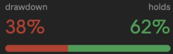

bar

| Category | Value (%) |
|---|---|
| drawdown | 38 |
| holds | 62 |

E(V) AT β 1.61

+15% mkt→MU +24% \$467

-25% mkt→MU-40% \$226

P/W expected value

\$376 = \$377

EARNINGS IMPLICATIONS

BEAR- \$220

-42%

Cycle turns. Capex trap fires. Samsung price aggression. LTA failure. Reverts to prior pitch floor.

what breaks it

HBM4E miss · LTAs not signed - recession + beta

BASE- \$590

+56%

Q3 delivers \$33.5B as guided. FCF \~\$40B FY26.10x multiple on \$59 EPS. Plateau not peak.

what confirms it July 1earnings - LTA in progress · HBM4 minority share on Rubin

BULL - \$885

+135%

LTAs signed with floor pricing. HBM4E qualified. 15× re-rating.CY27 EPS \$143 thesis in play.

what unlocks it

LTA floor confirmed · FY27 FCF \$60B+ · HBM4Ewin

# A Brief History of \$MU

Since last recommending Micron, it exceeded its long term bull scenario target of \$147 suggested back in 2022. As usual, it had its fair share of volatility. With a current 5 year beta of 1.61, the stock is known for being volatile, as well as the memory industry. The stock has moved like a trampoline since we first covered it in 2014. Starting in 2013 it moved from \$10 to \$30 in 2014 and fell back to \$10 in early 2016. From 2017 to 2020 we watched it rebound from \$35 to \$55 like clock work. In the late 2021 bubble however, it finally broke through new heights reaching \$90 a share, at the time of our last analysis. During that period, we were skeptical of the “inflation is transitory” narrative and suspected a bear market. Based on the fact we were reporting to a “value fund”, in the prior pitch we calculated the intrinsic value of the company, and therefore recommended a buy. However, as you can see in both that pitch, and the Meta Analysis which was ultimately a hold recommendation, we cited systematic and market risk. When speaking to the fund at the time about Micron, we mentioned discomfort buying under said market conditions, and recommended a limit-buy order around \$60. Since then, we saw it briefly surpass the prior price target of \$130, tagging nearly \$150 in June 2024. That's when they reported earnings, analysts were bullish, and sentiment was high with price targets of upper 180s-220s. Right before earnings, MU was top of the Barchart unusual options activity list. On June 18th, over 27,600 put contracts traded at the \$150 strike expiring just three days later, representing 89x the prior open interest on that contract. The stock was at \$153 at the time. Whether it was smart money hedging or bulls selling premium, the sheer volume was a signal worth noting. Earnings came June 26th, they beat, and the stock sold off 7% anyway. Classic sell-the-news after a 65% YTD run, and proceeded to get yanked back down to \$60 during the Liberation Day tariff freakouts of April 2025. From there, it went up and didn’t stop until March ‘26 when it peaked out around \$450. What we have with Micron, and the memory sector is a historically volatile and cyclical semiconductor sub industry. Now it seems we’re poised with the same questions. After a prior run up of nearly 6x, is this the same historically volatile stock (and subindustry) as it always has been, finishing its capital cycle? Is it the same story as before or has memory become less of a commodity that only a few companies can offer in this new AI regime? How long will the party keep going, and what determines that? Right now feels like a game of chicken, or standoff, after seeing a 25% pullback, we either have a great opportunity to capitalize on some more AI fun, or a great way to get run over 20-40% and be forced to recon with a position underwater.

# The main questions we need to answer are:

1)Do LTAs and HBM change the cyclicality of the memory, or at least push the cycle peak back?   
2)How much will MU and memory stocks continue to move relative to market risk, given its historical beta?   
3)Given the dispersion of stock, what are the likely catalysts in both directions, and why did we see a sell off of 30% and is this a warning sign or an opportunity?

# The selloff

FundaAI cited the TurboQuant kv cache article, which brought a narrative that less memory would be needed. However, a concept Marc Andreessen speaks to is, the cheaper it is, (memory, software) paradoxically, the more it will be used. With a basket beta of 2.3 and

Micron’s five year beta of 1.6, whatever the market does should have huge implications on the stock and the other memory players.

<table><tr><td colspan="2">2.330 BETA SPY</td><td>1.389 BETA SOXX</td><td colspan="5">4 CONSTITUENTS</td><td colspan="3">2 OPTIONS ELIGIBLE</td><td></td></tr><tr><td colspan="11">Research data from Apr 3, 2026 - Run npm run research to refresh</td><td></td></tr><tr><td colspan="11">CONSTITUENTS Live quotes via Tradier - Click ticker for details</td><td></td></tr><tr><td>TICKER</td><td>COMPANY</td><td></td><td>LAST</td><td>CHG%</td><td>β SPY</td><td>β SOXX</td><td>SIGNALS</td><td></td><td>TAGS</td><td></td><td></td></tr><tr><td>MU</td><td>Micron Technology Only US-headquartered DRAM and NAND manufacturer. Rapidly scaling HBM3E production for Nvidia H200 a...</td><td></td><td>$379.65</td><td>+3.67%</td><td>1.76</td><td>1.09</td><td>OPTIONS</td><td>LONG</td><td>hbm</td><td>ai_infrastructure</td><td>long</td></tr><tr><td>HXSCL</td><td>SK Hynix First-mover in HBM3E. SK Hynix supplies the HBM stack for Nvidia H100 and H200 - effectively sole-so...</td><td></td><td>-</td><td>-</td><td>-</td><td>-</td><td></td><td></td><td>hbm</td><td>ai_infrastructure</td><td></td></tr><tr><td>SSNLF</td><td>Samsung Electronics Largest memory manufacturer globally. Trailing SK Hynix in HBM qualification but has dominant NAND s...</td><td></td><td>$65.21</td><td>+0.00%</td><td>-</td><td>-</td><td></td><td></td><td>hbm</td><td></td><td></td></tr><tr><td>SNDK</td><td>SanDisk Corporation Pure-play NAND flash company spun off from Western Digital in 2024. AI training datasets, checkpoint...</td><td></td><td>$727.60</td><td>+3.71%</td><td>2.47</td><td>1.46</td><td>OPTIONS</td><td>LONG</td><td>nand</td><td>ai_infrastructure</td><td>long</td></tr></table>

# Source Data via Tradier Production API

For the past few years, a few companies have driven a large percentage of the SP500’s returns. With that in mind, we should approach Micron as a product of the overall market regardless of its internals. One of the main pieces to watch that not only could break the individual thesis for Micron, but for the market as well is the earnings, language, and capex of the hyperscalers and GPUs in that order. If those companies provide guidance that suggests compressed earnings, less demand for GPUs, server racks and therefore less demand for memory chips, surely memory and the overall market will reflect it quickly.

# HBM Qualifications

HBM is becoming the de-commoditizer of memory. As stated in Capital Returns, differentiated products, diverse end markets, barriers to entry and pricing power are necessities for companies to escape the capital cycle. High Bandwidth Memory or HBM is a differentiator for Micron, the only US-based company out of the four main memory providers above, and one of only three to provide HBM. The story is promising but not fully evolved into the business yet. In the figure below we can see the diversity of MU’s business units, as well as the growth of HBM.

Business Unit Revenue - The HBM Transformation (% share by period)

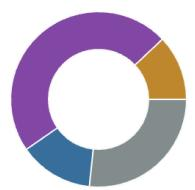  
FY23

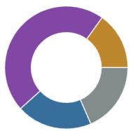  
FY24

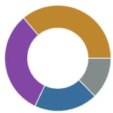  
FY25

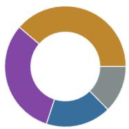  
FQ1-26

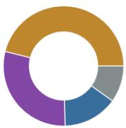  
FQ2-26 (est)

Cloud Memory (CMBU)

\$5.28B (FQ1-26)

Mobile & Client (MCBU)

\$4.26B (FQ1-26)

Core Data Center (CDBU)

\$2.38B (FQ1-26)

Auto & Embedded (AEBU)

\$1.72B (FQ1-26)

# Source Micron 10K

On top of being the product differentiator, HBM4 and beyond are also make-or-break for escaping, or at least extending the capital cycle. As of late 2025, HBM market share stood at 62% SK Hynix, 21% Micron, and Samsung 17%. Moreover, SK Hynix Inc. has filed to list its American depositary which would provide direct competition to Micron. If anything, that drives U.S. equity participants to SK Hynix and away from Micron. Regardless, further HBM4 qualification language and market delivery metrics are key signals.

The following describes the GPUs, timelines, and effects on companies’ cashflows.

<table><tr><td colspan="4">The GPU Generation Map — What Uses What Memory, When</td></tr><tr><td>Platform</td><td>Memory Type</td><td>Volume Production</td><td>Cash Flow Quarters for Micron</td></tr><tr><td>BlackwellB200/GB200</td><td>HBM3E</td><td>Throughout 2025-2026</td><td>FQ3-26, FQ4-26 (minimum)</td></tr><tr><td>Blackwell UltraB300</td><td>HBM3E (288GB 12-Hi)</td><td>H2 2025, ramping 2026</td><td>FQ3-26, FQ4-26</td></tr><tr><td>Vera Rubin NVL144</td><td>HBM4</td><td>H2 2026 (volume Q1 2027)</td><td>FQ4-26 (early), FQ1-27+</td></tr><tr><td>Rubin UltraNVL576</td><td>HBM4E</td><td>H2 2027</td><td>FQ1-28+</td></tr></table>

The most important aspect here is HBM4 qualification, and according to Semianalysis, Micron is lacking in necessary pinspeed thresholds to qualify. However, as of March 16th, they issued a press release claiming they reached the necessary pinspeeds for HBM4. Assuming this is true, we can give a high probability to receiving ample revenue through at least Q1 2027. However, NVDA plans only to produce 1.5M Rubin GPUs due to qualification issues with HBM4 as opposed to the predicted 2M. With these facts in mind, the key signals to watch are hyperscaler and data center forward guidance, and memory shipment data to track share among the three oligopolists.

# LTA contracts and Memory Super Cycle

LTAs (long term agreements) have been rumored to be game changing, breaking memory out of the traditional capital cycle. Beforehand, contracts operated on a twelve month basis. Now, there are talks of LTAs ranging from three to five years. This makes sense as SK Hynix is already providing quality updates and arrival estimates for HBM5 in 2029. On the LTAs, Citrini’s semi analysts @zephyr\_z9 and @jukan05 reported in late 2025 that Google execs had been fired for failure to secure long term agreements and that SK Hynix and Micron said that supply was capped. These LTAs are a result of constant increases in memory prices. Apparently Samsung saw price increases of 100% FY26 Q1 and 30% on top of that in Q2. This implies continued favorable supply side conditions. Such extreme pricing power also implies a glut is not on the horizon quite yet, otherwise, a company couldn’t raise supply prices 260% in just two quarters time. This behavior gives confidence in avoiding, or at least delaying the extreme negative downturn that comes with investing in semis and memory due to their hyper-cyclical characteristics.

# Capital Cycles: A New Regime? Or a Delayed Drawdown?

Let’s not pretend like everything has changed, however, the “memory super cycle” has a fun ring to it. Given the figure above, we can at least issue a high probability of cash flows through Q1 2027. However,

Citrini Research noted:

The classic demand response from companies like Samsung and SK Hynix has been to lean in, increase capacity and inevitably glut the market. In all honesty, they probably aren't wrong. That's likely going to happen at some point — I'm not clairvoyant so I can't exactly tell you when (if I had to guess, sometime in 2027), but human behavior is predictable and, normally, greed does win out in the end even when supply is controlled by a cartel-like dynamic.

— Citrini Research, [January 2026]

That prognosis pairs well with our estimates of shipments above. Sniffing out the next glut and cyclical slowdown seems to be the name of the game. It’s tempting to declare a paradigm shift. History rhymes. Taleb wisely noted, near the prior cyclical peak, that he’s never seen a shortage without a glut (although apparently gluts need not be followed by shortages, Modus Tollens).

# Where does this leave us?

There’s no escaping the volatile nature of this stock. The market has been on its toes for years now, while AI has been its hercules. We’re at risk of oil and food causing another inflationary run up, which threatens the global economy, and risks re-hikes. Le Shrub holds his market crash probability at 44.44%, while there’s a 32% US recession probability via Polymarket as of writing this. So we can assign a 38% probability of a market drawdown.

# Valuation and Market Thoughts

The hardest part is predicting and valuing Micron’s future cash flows.

If we just go two years out on a linear basis, we know they generated \$3.9B in the first quarter, \$6.9B in Q2, and had Q2 guidance stating they “could see cash flow roughly double sequentially.” So if we just apply that linearly that means \$14B in Q3 and say the same for Q4, that gives us a FY26 cashflow of about \$40 billion conservatively. Because of the heavy depreciation and capex I’m not going to try to value Micron based on FCF figures, but it's worth noting they anticipate annual capex of nearly \$25 billion, and cash flows from \$40 to \$50 billion.

Earnings history & estimates by fiscal quarter   
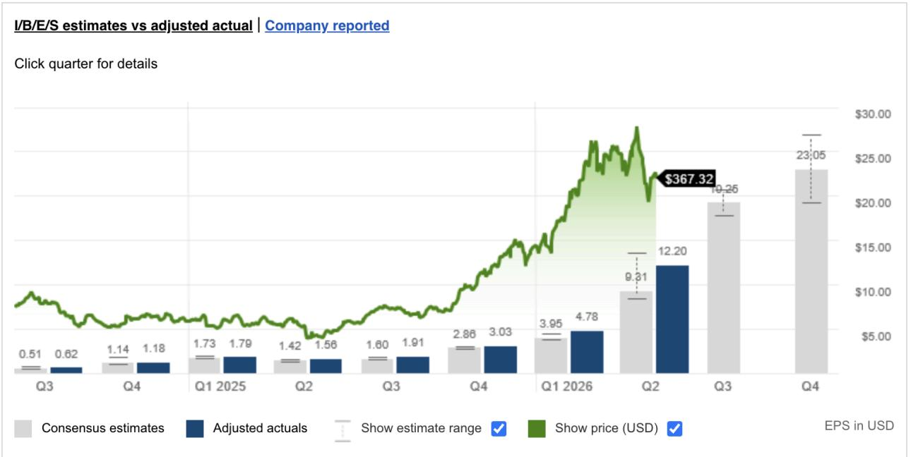

bar_line

I/B/E/S estimates vs adjusted actual | Company reported
Click quarter for details
| Quarter | Consensus estimates | Adjusted actuals | Show estimate range (Lower) | Show estimate range (Upper) | Show price (USD) | EPS in USD |
| :--- | :--- | :--- | :--- | :--- | :--- | :--- |
| Q3 | 0.51 | 0.62 | | | | |
| Q4 | 1.14 | 1.18 | | | | |
| Q1 2025 | 1.73 | 1.79 | | | | |
| Q2 | 1.42 | 1.56 | | | | |
| Q3 | 1.60 | 1.91 | | | | |
| Q4 | 2.86 | 3.03 | | | | |
| Q1 2026 | 3.95 | 4.78 | | | | |
| Q2 | 9.31 | 12.20 | | | | $367.32 |
| Q3 | 19.25 | | | | | |
| Q4 | 23.05 | | | | | |

# Source Fidelity Investments

If Q3 and Q4 deliver as expected as seen in the figure above, that would give TTM EPS at \$50.28. With that, we can extrapolate a simple EPS valuation. With expectations of \$19.25 and \$23.05 EPS for Q3 and Q4 respectively, that would give us a base of approximately \$59 earnings per share. Based on that, we can derive a simple sensitivity analysis:

<table><tr><td></td><td>FY EPS</td><td>39</td><td>49</td><td>59</td></tr><tr><td>Commodity</td><td>6</td><td>234</td><td>294</td><td>354</td></tr><tr><td>Historical Avg</td><td>10</td><td>390</td><td>490</td><td>590</td></tr><tr><td>Growth Prospects</td><td>15</td><td>585</td><td>735</td><td>885</td></tr></table>

Here is what is likely to happen. Micron should meet that \$59 EPS mark as they haven’t missed guidance since Q1 to 2023. Moreover…

<table><tr><td>Quarter</td><td>Report date</td><td>Report time</td><td>Consensus est. EPS ($)</td><td>Adjusted actuals EPS ($)</td><td>EPS difference</td></tr><tr><td>Q2 2023</td><td>03/28/23</td><td>--</td><td>-0.86(26 Analysts)</td><td>-1.91</td><td>-1.05</td></tr><tr><td>Q1 2023</td><td>12/21/22</td><td>--</td><td>-0.01(26 Analysts)</td><td>-0.04</td><td>-0.03</td></tr><tr><td>Q4 2022</td><td>09/29/22</td><td>--</td><td>1.30(24 Analysts)</td><td>1.45</td><td>+0.15</td></tr><tr><td>Q3 2022</td><td>06/30/22</td><td>--</td><td>2.43(27 Analysts)</td><td>2.59</td><td>+0.16</td></tr><tr><td>Q2 2022</td><td>03/29/22</td><td>--</td><td>1.97(28 Analysts)</td><td>2.14</td><td>+0.17</td></tr><tr><td>Q1 2022</td><td>12/20/21</td><td>--</td><td>2.11(28 Analysts)</td><td>2.16</td><td>+0.05</td></tr><tr><td>Q4 2021</td><td>09/28/21</td><td>--</td><td>2.33(24 Analysts)</td><td>2.42</td><td>+0.09</td></tr><tr><td>Q3 2021</td><td>06/30/21</td><td>--</td><td>1.72(27 Analysts)</td><td>1.88</td><td>+0.16</td></tr><tr><td>Q2 2021</td><td>03/31/21</td><td>--</td><td>0.95(25 Analysts)</td><td>0.98</td><td>+0.03</td></tr><tr><td>Q1 2021</td><td>01/07/21</td><td>--</td><td>0.71(24 Analysts)</td><td>0.78</td><td>+0.07</td></tr></table>

Source Fidelity Investments

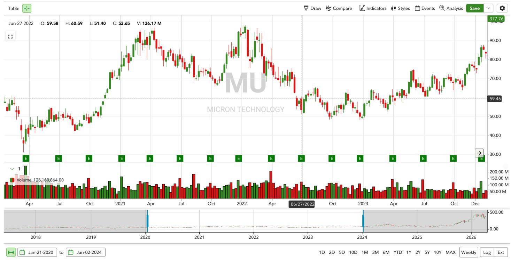

bar_line

| Date       | Price | Volume     |
|------------|-------|------------|
| 06/27/2022 | 59.46 | 126,169,864.00 |
| Jun-27-2022 | 59.58 | -          |
| Jul-2022   | 60.59 | -          |
| Oct-2022   | 51.40 | -          |
| Jan-2023   | 53.65 | -          |
| Apr-2023   | -     | -          |
| Jul-2023   | -     | -          |
| Oct-2023   | -     | -          |
| Dec-2023   | -     | -          |
| Jan-2024   | -     | -          |
| Apr-2024   | -     | -          |
| Jul-2024   | -     | -          |
| Oct-2024   | -     | -          |
| Dec-2024   | -     | -          |

Source: Fidelity Investments

…the market is a step ahead of earnings. It pays for future earnings. Look at the large red candle in December 2022, and look at the earnings difference above, the growth got cut in half and the market called cycle top, and it was right. EPS went from 2.59 to 1.45.

<table><tr><td>FY 2026</td><td></td><td>Q2</td><td>Q3E</td><td>Q4E</td></tr><tr><td></td><td>TTM EPS</td><td>21</td><td>39.26</td><td>59.28</td></tr><tr><td>Commodity</td><td>6</td><td>126</td><td>235.56</td><td>355.68</td></tr><tr><td>Historical Avg</td><td>10</td><td>210</td><td>392.6</td><td>592.8</td></tr><tr><td>Growth Prospects</td><td>15</td><td>315</td><td>588.9</td><td>889.2</td></tr></table>

We can proceed under the premise that most market participants are playing the same game, looking for the delta in growth that indicates a cycle transition. Even if it's a few quarters away, that's what's priced in today. The market anticipates, and pays for where the puck will be. As we saw with the massive selloff of Meta in 2022, the rate of daily active users caused a huge drawdown as the market anticipated rotation in Meta’s company lifecycle. Based on our sensitivity analysis of TTM EPS, the market seems to be pricing Micron pretty fairly. It wants to see the cards on the river. We don’t have Q4 guidance, we don’t have SCA (special customer agreements) LTAs aren’t completely spelled out, we don’t know Microns HBM4 and HBM4e market share, and therefore we can’t confidently draw out cashflows into Q1 and Q2 2027. LTAs and HBM4 are the castles in the sky for FY27 guidance.

On the downside, if any of those aspects fail, we already know Micron has 2026 expected Capex of 25B as of Q2 earnings with a “meaningful step up in fiscal 2027.” It seems probable that Citrini is likely right in that 2027 is when we need to heed caution in this heavy capex investment as it may be a leading indicator of a cyclical peak.

# Capital Cycles Framework

The Capital Cycles framework is a useful metric to use for evaluating the semis and memory space, the length of the continued cashflows, and in turn the pricing power and supply side constraints. The book claims that “In semiconductors, excess profits are wrung out in less than two years” and that claims of a “supercycle” are nothing novel.” Sound familiar? Using a capital cycles framework in addition to conventional valuation methods in this space is key as the authors are skeptical of precise financial modeling, observing that "investors like modelling because it appears scientific" but that "detailed forecasting adds little value" and can "encourage anchoring".

A takeaway from that framework which we can deduce is that undersupply leads to large investments in capital, which erodes excess cashflows, and eventually gluts the market. All else equal, if we just focus on the supply side, it’s basic economic theory.

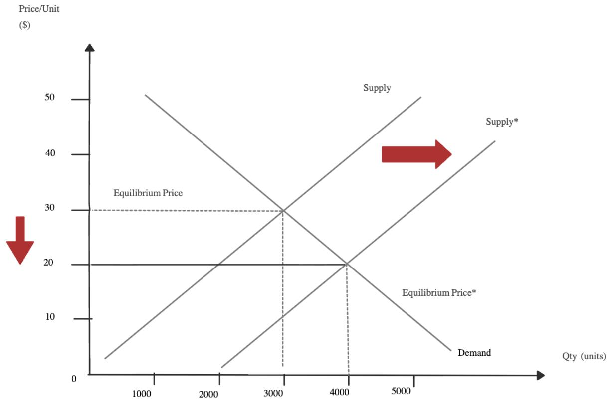

line

| Qty (units) | Supply | Supply* | Equilibrium Price* | Demand |
|-------------|--------|---------|--------------------|--------|
| 0           | 50     | 50      | 0                  | 0      |
| 2000        | 40     | 40      | 10                 | 10     |
| 3000        | 30     | 30      | 20                 | 20     |
| 4000        | 20     | 20      | 30                 | 30     |
| 5000        | 10     | 10      | 40                 | 40     |

Graph Source

If the market gets flooded with supply and prices lower, the companies excess cashflow fades and are left to foot their bill of their over investment. Moreover, we can see that the main three players are going heavy on capex now, with Micron predicting \$25 billion for FY2026, Samsung at \$73B yearly, and SK Hynix around \$20 billion.

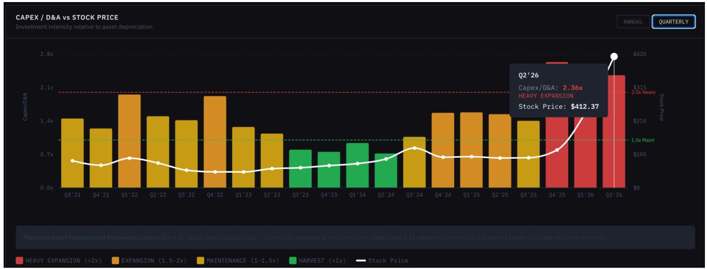

bar_line

CAPEX / D&A vs STOCK PRICE
| Period | CAPEX/D&A (x) | Stock Price ($) | Volume (x) |
| :--- | :--- | :--- | :--- |
| Q3'21 | 1.4 | 1.0x |  |
| Q4'21 | 1.35 | 1.0x |  |
| Q1'22 | 1.9 | 1.0x |  |
| Q2'22 | 1.45 | 1.0x |  |
| Q3'22 | 1.4 | 1.0x |  |
| Q4'22 | 1.9 | 1.0x |  |
| Q1'23 | 1.35 | 1.0x |  |
| Q2'23 | 1.3 | 1.0x |  |
| Q3'23 | 0.7 | 1.0x |  |
| Q4'23 | 0.7 | 1.0x |  |
| Q1'24 | 0.75 | 1.0x |  |
| Q2'24 | 0.7 | 1.0x |  |
| Q3'24 | 0.85 | 1.0x |  |
| Q4'24 | 1.45 | 1.0x |  |
| Q1'25 | 1.45 | 1.0x |  |
| Q2'25 | 1.45 | 1.0x |  |
| Q3'25 | 1.4 | 1.0x |  |
| Q4'25 | 1.45 | 1.0x |  |
| Q1'26 | 1.45 | 1.0x |  |
| Q2'26 | 2.36 | 420 |  |
Annual Quarterly
Capex/D&A: 2.36x
HEAVY EXPANSION: $412.37
Stock Price: $412.37

# Source Micron FMP Data

We can see that from a capex to depreciation standpoint, Micron’s investment is signaling the end of the cycle is near based on history, and the concept that excess profits usually go on for about two years should give us an idea of where the company stands in the cycle.

DRAM INDUSTRY CONCENTRATION (Herfindahl-Hirschman Index)   
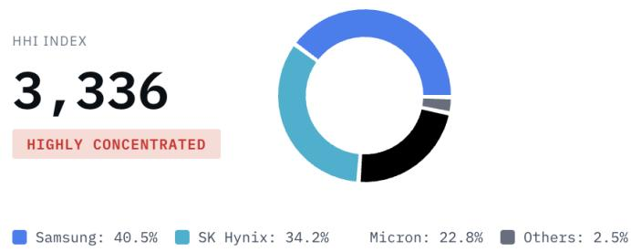

pie

HHI INDEX
| Category | Percentage (%) |
| :--- | :--- |
| Samsung | 40.5 |
| SK Hynix | 34.2 |
| Micron | 22.8 |
| Others | 2.5 |
HIGHLY CONCENTRATED
3,336

On the positive side, when the index in the figure above is greater than 2500, the industry is considered highly concentrated, and reflects the market control via the oligopoly of companies. This is a positive note in terms of avoiding commoditization and barriers to entry. However, as we can see below, the index was only slightly lower in 2020 near last cyclical peak.

# HHI INTERPRETATION:

<1,500:Competitive market   
1,500-2,500: Moderately concentrated   
>2,500: Highly concentrated (current: 3,336)

<table><tr><td>YEAR</td><td>HHI</td><td>PLAYERS</td><td>STATUS</td></tr><tr><td>2000</td><td>1,200</td><td>8+</td><td>Fragmented</td></tr><tr><td>2005</td><td>1,800</td><td>6</td><td>Moderately concentrated</td></tr><tr><td>2010</td><td>2,100</td><td>5</td><td>Moderately concentrated</td></tr><tr><td>2015</td><td>2,600</td><td>4</td><td>Highly concentrated</td></tr><tr><td>2020</td><td>3,100</td><td>3</td><td>Highly concentrated</td></tr><tr><td>2025</td><td>3,336</td><td>3</td><td>Highly concentrated</td></tr></table>

# Source Trendforce

# Summary

There is a decent narrative to be made consisting of a memory super cycle, LTAs, pricing power, and hyperscaler and datacenter HBM demand. Micron looks to be a beneficiary of this story, being the only American company in a three entity oligopoly. Moreover, the story sheds light on other externalities in the AI and semis space as well. We know that optics are the next big thing as the market has clearly priced that in. We also know the market is forward looking. As soon as a big beat comes out, guidance is announced, and contracts are either signed or fall through, it should hit the tape rather quickly, and then we will see another chop period until the next big catalyst. We’ve seen this before, the market prices and categorizes what it believes is three to five quarters ahead: growth, stagnance, or decline. Just as Stanley Druckenmiller says: “visualize 18 to 24 months from now what the world is going to look like and what securities might trade at.” Tech and semis are pretty good at making that visualization. That being said, should the AI cycle continue, memory and other adjacent semi companies should benefit as indispensable inputs in the race to AGI. When considering \$MU, both a capital cycle and intrinsic value standpoint should be taken when thinking about a position for your book. As is outlined in Capital Returns, “Long-term investors are better suited to applying the capital cycle approach.” If things in the market don’t turn too sour, and the big hyperscaler and data center companies spell out at least consensus guidance and language, we could see continued growth for possibly the next four quarters, allowing for upwards of 50% stock appreciation to the \$590 levels. However, if FY26 Q4 and FY27 Q1 guidance suggest slowdowns or headwinds, and the market conditions continue to deteriorate, we could see the stock take a dive another -40% to the 220 levels.

# Catalyst Calendar

Things to Watch - Catalyst Calendar 

<table><tr><td>Date</td><td>Event</td><td>Priority</td><td>What to Watch</td></tr><tr><td>Apr 23-29</td><td>Samsung Q1 + SK Hynix Q1 earnings</td><td>CRITICAL</td><td>Peer confirmation of 3-4× YoY OP. Q2 pricing guidance &amp; HBM4 shipment volumes.</td></tr><tr><td>May-Jun</td><td>Q3 DRAM contract pricing round</td><td>CRITICAL</td><td>Samsung Securities: &#x27;pace of price increases begins to moderate from Q3 - early signs could trigger share price correction May-June.&#x27;</td></tr><tr><td>May-Jun</td><td>Microsoft / Google LTA signing status</td><td>CRITICAL</td><td>Minimum price floor terms confirmed or diluted? 3-year deal signed vs 1-year floating? This is the #1 structural bull validator.</td></tr><tr><td>Mid-Jun</td><td>Hyperscaler Q2 earnings (MSFT, GOOGL, AMZN, META)</td><td>HIGH</td><td>AI capex guidance for H2 2026 - Samsung Securities&#x27; &#x27;real peak signal.&#x27; Not spot prices.</td></tr><tr><td>Jul 1</td><td>Micron Q3 FY2026 earnings</td><td>CRITICAL</td><td>$33.5B guided, ~81% GM. Does the number land? Any FY27 visibility change? HBM4E qualification language.</td></tr><tr><td>Late 2026</td><td>HBM4E qualification status</td><td>HIGH</td><td>Micron internal base die vs TSMC base die (SK Hynix/Samsung). The generational moat reset.</td></tr><tr><td>Ongoing</td><td>CXMT DDR5 ramp monitoring</td><td>MEDIUM</td><td>Chinese DRAM at scale would hit consumer/PC DDR5, not HBM. Monitor for blended margin impact.</td></tr></table>

Samsung Securitiesframework (March 30,2026):"Cyclical peak-outs originate from changes in downstream industries.Early signs canbeidentifiedthroughbusiness rajectoryshiftsatOpenAI,Anthropic,andtheISPs-webelievethereisstillupside to be demonstrated from the demand side."The May-June contract pricing round and hyperscaler Q2 earnings arethe decisive near-term arbiters. Not spot prices.

Data in visual from: Samsung Securities (March 30, 2026) · Hankyung / Korea Economic Daily (April 5, 2026) · Meritz Securities via Hankyung (April 3, 2026) · SemiAnalysis (August 2025, March 2026) · Micron Technology Q2 FY2026 Earnings Call (March 18, 2026) · TrendForce (March 17, 2026) · @jukan05, Citrini Research